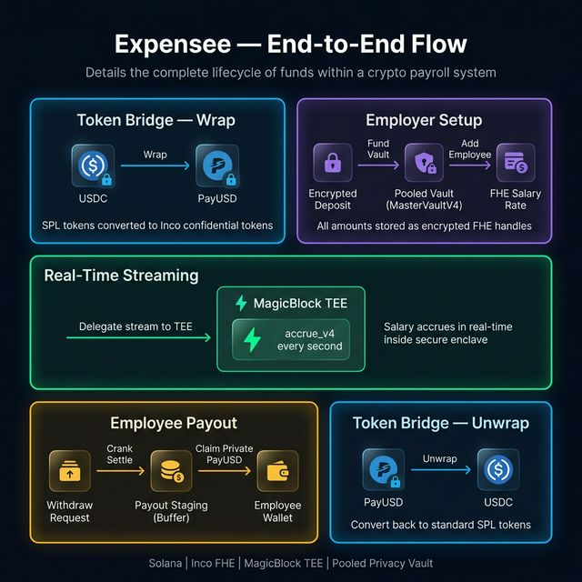
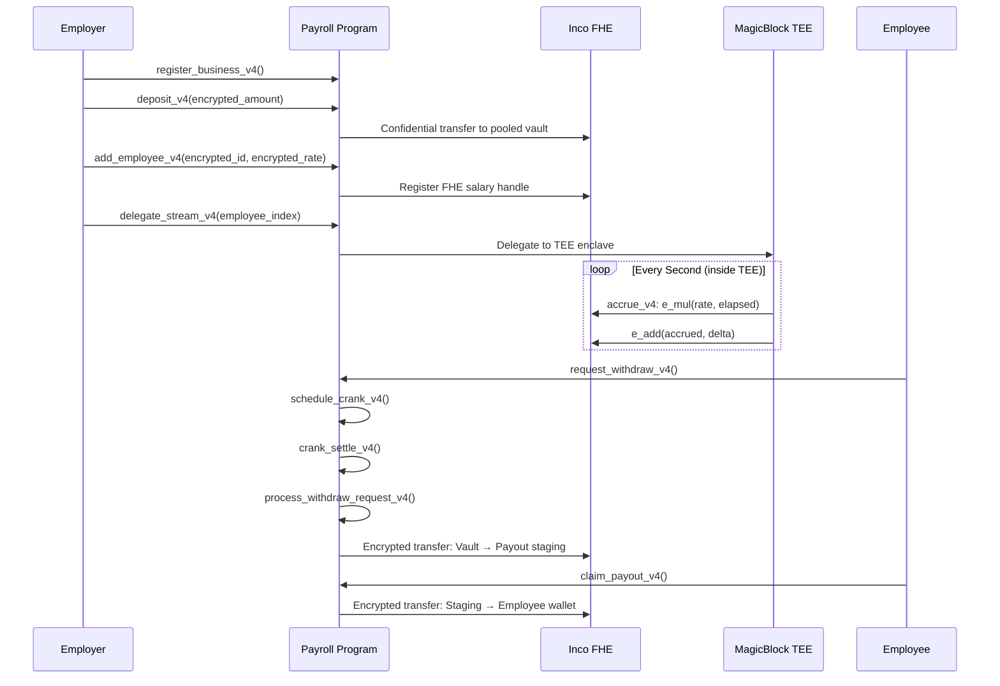
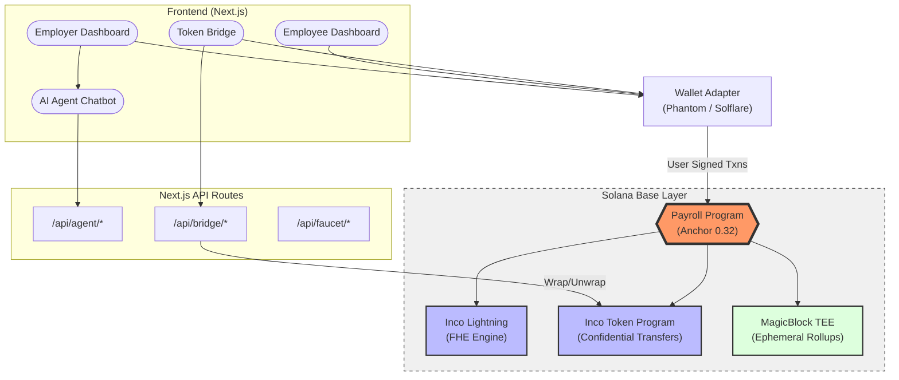
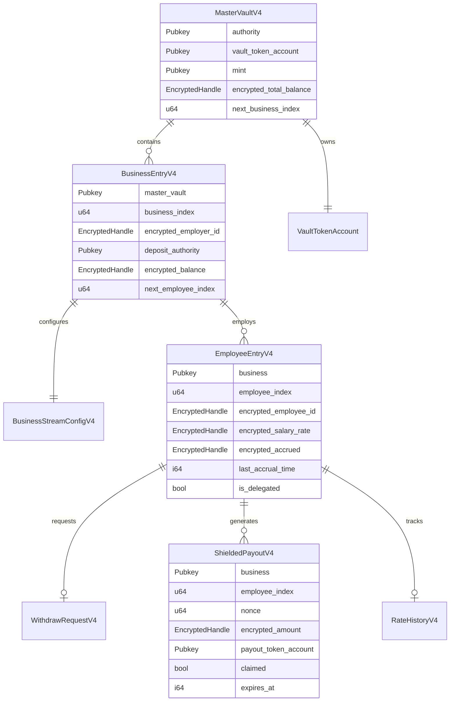

<p align="center">
  <strong>Expensee</strong>
</p>

<p align="center">
  <em>Private Real-Time Payroll on Solana — Powered by FHE & MagicBlock TEE</em>
</p>

<p align="center">
  <a href="#the-problem">Problem</a> •
  <a href="#market-opportunity">Market</a> •
  <a href="#competitive-landscape">Competitors</a> •
  <a href="#go-to-market-strategy">GTM</a> •
  <a href="#business-model">Business Model</a> •
  <a href="#magicblock-integration">MagicBlock</a> •
  <a href="#how-it-works">How It Works</a> •
  <a href="#architecture">Architecture</a> •
  <a href="#roadmap">Roadmap</a> •
  <a href="#getting-started">Getting Started</a>
</p>

---

## Overview

**Expensee** is a confidential, real-time salary streaming protocol on Solana. Employers fund an encrypted vault, add employees with FHE-encrypted salary rates, and salaries accrue every second inside MagicBlock TEE enclaves. Employees can auto-detect their record with **Magic Scan**, reveal their live earnings, and withdraw — all without exposing compensation data on-chain.

> Expensee uses MagicBlock as the real-time execution layer, specifically through Ephemeral Rollups, TEE execution, router-based scheduling, and delegated stream settlement.

### Key Features

| | |
|---|---|
| **FHE-Encrypted Salaries** | Salary rates and balances stored as encrypted handles via Inco Lightning — invisible on-chain |
| **Real-Time Streaming** | Earnings accrue every second inside MagicBlock TEE enclaves with sub-10ms latency |
| **Magic Scan** | One-click auto-detection of employment records — no manual business/employee index needed |
| **Pooled Privacy Payouts** | Withdrawals route through a shared vault — wallet-to-employee link stays private |
| **AI Agent Chatbot** | Built-in conversational assistant that handles payroll setup through natural language |
| **Keeper-Free Design** | Fully on-chain crank-based settlements — no off-chain servers or relay services required |

> *Expensee: Private, real-time payroll infrastructure on Solana.*

---

## MagicBlock Integration

MagicBlock is not a decorative dependency in Expensee. It powers the v4 real-time streaming path end-to-end:

1. The employer delegates an employee stream to a MagicBlock validator.
2. The payroll program schedules the autonomous crank on the MagicBlock router.
3. The TEE accrues salary in the delegated execution environment.
4. The stream is committed back to Solana base layer when settlement or mutation is needed.
5. The stream is redelegated so real-time payroll resumes.

### End-to-End Flow

<p align="center">
  
</p>

If you want the fastest way to understand the integration, start here:

- [docs/MAGICBLOCK.md](docs/MAGICBLOCK.md)
- [`app/lib/magicblock/index.ts`](app/lib/magicblock/index.ts)
- [`app/lib/payroll-client.ts`](app/lib/payroll-client.ts)
- [`app/pages/employer.tsx`](app/pages/employer.tsx)
- [`app/pages/employee.tsx`](app/pages/employee.tsx)
- [`programs/payroll/src/lib.rs`](programs/payroll/src/lib.rs)
- [`app/pages/api/magicblock`](app/pages/api/magicblock)


---

## The Problem

### Salary Transparency Destroys Companies From the Inside

On a public blockchain, **every salary is visible**. When employees discover compensation gaps — even justified ones — it breeds resentment and attrition.

- Employee A discovers Employee B earns 30% more. Morale collapses.
- Top performers leave when they learn junior hires negotiated higher.
- Private bonuses become public knowledge. Everyone expects one.
- Every raise is visible — compensation becomes office gossip.

### Outsiders Can Read Your Entire Payroll

- **Competitors** see your burn rate and poach talent by outbidding exact salaries
- **Investors** reverse-engineer your runway from payment flows
- **Bad actors** identify high earners and target them
- **Every payout** creates a permanent employer-to-employee link on-chain

### Workers Earn Every Second But Get Paid Every 30 Days

Traditional payroll forces a **30-day liquidity gap**. Workers generate value from minute one but only access earnings weeks later. Cross-border teams wait 3–5 days for SWIFT settlements, losing 3–7% to fees.

### How Expensee Solves All Three

| Problem | Solution |
|---------|----------|
| Public salaries | **FHE encryption** — all amounts stored as encrypted handles, invisible to everyone |
| Employer-to-employee linkage | **Pooled vault** — withdrawals route through a shared pool, breaking wallet traceability |
| Monthly pay cycles | **Real-time streaming** — salary accrues every second via MagicBlock TEE |
| Complex setup | **AI chatbot** — natural language payroll configuration in minutes |

---

## Who Is It For?

| User | What They Get |
|------|-------------|
| **Web3 Startups & DAOs** | Private payroll that protects compensation data — no salary leaks, no org chart exposure |
| **Remote-First Companies** | Instant global payouts on Solana — no SWIFT, no 5-day waits, no 3–7% fees |
| **Freelancers & Contractors** | Real-time earnings that stream every second — withdraw on demand |
| **Employees** | Magic Scan auto-finds your record, reveal encrypted earnings, request payouts — zero friction |

---

## Market Opportunity

The on-chain payroll market is accelerating as crypto compensation goes mainstream.

| Metric | Value | Source / Context |
|--------|-------|-----------------|
| **Global payroll outsourcing market** | ~$12 B (2024) | Traditional payroll — ripe for disruption |
| **Crypto payroll market** | ~$1.5 B (2024) → projected **$6.4 B by 2033** | 19.2% CAGR driven by remote work and stablecoin adoption |
| **Cross-border payment flows** | $39.9 T (2024) → $64.5 T by 2032 | Crypto reduces fees by up to 95% vs SWIFT |
| **Active DAO treasuries** | 12,000+ DAOs managing **$28 B** on-chain | Growing need for private, automated contributor payments |
| **Crypto salary adoption** | 3% (2023) → 9.6% (2024) → **25%+ of businesses by 2025** | Stablecoins account for 90%+ of digital salaries (USDC 63%) |

**Why now:** By 2026, stablecoin payroll has crossed the early-adopter chasm. Regulatory clarity is improving, enterprise blockchain adoption is maturing, and Gen-Z workforce expectations are shifting toward real-time, crypto-native compensation. Yet **no protocol offers salary privacy** — until Expensee.

---

## Competitive Landscape

Expensee is the **only protocol** that combines FHE-encrypted salaries, pooled-vault privacy, and real-time TEE streaming. Here's how we compare:

| Feature | Expensee | Superfluid | Sablier | Zebec |
|---------|:--------:|:----------:|:-------:|:-----:|
| **Salary Privacy (FHE)** | ✅ | ❌ | ❌ | ❌ |
| **Pooled Vault** (breaks employer↔employee traceability) | ✅ | ❌ | ❌ | ❌ |
| **Real-Time Streaming** | ✅ MagicBlock TEE | ✅ Protocol-level | ✅ Smart Contract | ✅ |
| **AI Setup Assistant** | ✅ | ❌ | ❌ | ❌ |
| **Auto-Discovery (Magic Scan)** | ✅ | ❌ | ❌ | ❌ |
| **Keeper-Free / Permissionless** | ✅ On-chain cranks | Partial | ✅ | ❌ Requires infra |
| **Chain** | Solana | EVM (multi-chain) | EVM (multi-chain) | Solana / Multi |
| **Target Users** | Startups, DAOs, remote teams | DeFi, DAOs | DAOs, vesting | Enterprise, SMBs |

### Where Competitors Fall Short

- **Superfluid / Sablier**: Great streaming primitives, but **all salary data is fully public on-chain**. Any explorer can see who pays whom and how much. No privacy at all.
- **Zebec**: Closest in ambition (real payroll on Solana), but focuses on TradFi integration and compliance — salaries are still transparent on-chain, and it relies on centralized infrastructure.
- **Expensee**: The **privacy-first** payroll protocol. FHE means salary rates and balances are mathematically invisible. The pooled vault means even the employer-employee link is hidden. Nobody else does this.

---

## Go-To-Market Strategy

### Phase 1 → Web3 Startups & DAOs *(now)*
- **Why first**: Treasury already on-chain, crypto-native teams, immediate product-market fit
- **Wedge**: "Your contributor salaries are public right now — competitors can see your entire org chart and burn rate"
- **Distribution**: Solana ecosystem partnerships, hackathon demos, developer content, DAO governance proposals

### Phase 2 → Remote-First Companies *(next)*
- **Why**: 70M+ global remote workers, cross-border payroll is painful (3–7% fees, 3–5 day waits)
- **Wedge**: "Pay your global team in seconds for <$0.01 per transaction — no SWIFT, no intermediaries"
- **Distribution**: HR/payroll platform integrations, stablecoin on-ramp partnerships

### Phase 3 → Freelancer Platforms & Contractor Networks
- **Why**: Gig economy workers earn every second but get paid every 30 days
- **Wedge**: "Real-time salary streaming — withdraw your earnings the moment you earn them"
- **Distribution**: Platform SDK, white-label integration for freelancer marketplaces

### Growth Levers
- **AI Agent virality** — "Set up payroll by chatting" is a demo that sells itself
- **Magic Scan UX** — Zero-config employee onboarding lowers adoption friction to near zero
- **Privacy as a moat** — Once a company encrypts salaries with FHE, switching cost is high

---

## Business Model

Expensee generates revenue through protocol-level fees and premium services — no rent-seeking middlemen, just infrastructure that earns as it scales.

| Revenue Stream | How It Works | When |
|---------------|-------------|------|
| **Protocol Fee** | 0.1–0.5% fee on every withdrawal/payout processed through the pooled vault | From mainnet launch |
| **Premium Tier** | Monthly subscription for advanced features: batch operations, compliance exports, multi-signer vaults, priority settlement | Post-mainnet |
| **Vault Yield** | Idle funds in the pooled vault generate yield via DeFi integrations (lending protocols, liquid staking) — protocol keeps a performance fee | Post-mainnet |
| **SDK Licensing** | White-label Expensee for freelancer platforms, HR tools, and payroll providers — per-seat or revenue-share model | Phase 2–3 |

### Unit Economics

- **Cost to serve**: Near-zero marginal cost — all logic is on-chain, no off-chain servers to maintain
- **Revenue scales with volume**: More businesses × more employees × more withdrawals = compounding protocol fees
- **Privacy creates lock-in**: Once salaries are encrypted with FHE, migration cost is high — strong retention moat

### Why This Works

Traditional payroll processors (ADP, Gusto, Deel) charge **$6–$12 per employee per month**. Expensee's protocol fee model is 10–100× cheaper for the employer while generating sustainable revenue at scale. A single DAO with 50 contributors streaming $5K/month each = $250K monthly volume → $250–$1,250/month in protocol fees, growing linearly with adoption.

---

## Roadmap

| Status | Milestone |
|:------:|-----------|
| ✅ | **Devnet live** — FHE streaming, Magic Scan, AI agent, pooled payouts fully functional |
| ✅ | **V4 architecture** — Keeper-free, crank-based settlements, shielded payouts |
| 🔜 | **Mainnet beta** — Production deployment on Solana mainnet |
| 🔜 | **Multi-business batch ops** — Bulk employee onboarding, batch deposits |
| 🔜 | **Payslip NFTs** — On-chain verifiable proof of payment for employees |
| 🔜 | **Compliance exports** — Tax-ready reports, jurisdiction-aware summaries |
| 🔜 | **SDK & API** — Third-party integrations for platforms and payroll providers |
| 🔜 | **Mobile experience** — Employee app for real-time balance tracking and withdrawals |

---

## How It Works

### For Employers

1. **Connect Wallet** — Sign in with Phantom or Solflare
2. **Register Business** — Creates an encrypted business entry in the pooled vault
3. **Deposit Funds** — Transfer PayUSD into the encrypted business vault
4. **Add Employees** — Define encrypted salary rates per employee
5. **Grant View Access** — Allow employees to decrypt their own earnings
6. **Delegate to TEE** — Enable real-time MagicBlock streaming
7. **Done** — Salary streams automatically, no maintenance required

### For Employees

1. **Connect Wallet** — Sign in with your wallet
2. **Magic Scan** — Auto-detects your employment record on-chain (checks Allowance PDAs, then decrypts your identity handle)
3. **View Earnings** — Reveal your live accrued balance via attested decryption
4. **Request Withdraw** — One-click withdrawal request
5. **Claim Payout** — Funds arrive in your wallet through the pooled vault

### Real-Time Streaming Flow



---

## Architecture

### High-Level System Architecture



### Key Design: Keeper-Free Architecture

Unlike V2 which relied on an off-chain Keeper service and Umbra Relay for settlement, **V4 is fully on-chain**:

- **Crank-based settlements** — Anyone can call `crank_settle_v4` and `process_withdraw_request_v4` to process pending withdrawals
- **No relayer needed** — Employees claim payouts directly to their own wallet
- **Pooled vault** — A single `MasterVaultV4` holds funds for all businesses, breaking wallet-to-employer traceability
- **Schedule + execute pattern** — `schedule_crank_v4` queues work, `crank_settle_v4` executes it permissionlessly

### Technology Stack

| Technology | Role |
|------------|------|
| **Solana** | High-throughput L1 — sub-second finality, ~$0.001 tx costs make per-second streaming viable |
| **Inco Lightning** | FHE engine — math on encrypted data without decrypting. `e_mul(rate, time)` computes salary without revealing the rate |
| **MagicBlock TEE** | Ephemeral Rollups — delegates stream accounts to a Trusted Execution Environment for real-time accrual (~10ms ticks) |
| **Anchor 0.32** | Smart contract framework — required for MagicBlock's `#[ephemeral]` macro and Inco CPI integration |
| **Next.js** | Frontend framework — employer/employee dashboards, AI agent chat, token bridge |

---

## On-Chain Program

**Program ID:** `3P3tYHEUykB2fH5vxpunHQH3C7zi9B3fFXyzaRP38bJn`
**Framework:** Anchor 0.32.1 · Rust

### V4 Account Model



### V4 Instruction Set

| Category | Instruction | Description |
|----------|------------|-------------|
| **Setup** | `init_master_vault_v4` | Create the global pooled vault |
| | `set_pool_vault_v4` | Link the confidential token account to the vault |
| | `register_business_v4` | Register a business entry under the master vault |
| | `init_stream_config_v4` | Configure settlement interval for a business |
| **Employee** | `add_employee_v4` | Add employee with encrypted ID and salary rate |
| | `init_rate_history_v4` | Initialize salary rate audit trail |
| | `update_salary_rate_v4` | Change salary rate (accrue first, then swap) |
| **Token** | `init_user_token_account_v4` | Create a user's Inco token account registry |
| | `link_user_token_account_v4` | Link an existing Inco token account |
| **Funding** | `deposit_v4` | Encrypted deposit into business vault |
| **Streaming** | `accrue_v4` | FHE: `accrued += salary_rate × elapsed` |
| | `delegate_stream_v4` | Delegate stream to MagicBlock TEE |
| | `commit_and_undelegate_stream_v4` | Return stream to base layer |
| | `redelegate_stream_v4` | Re-delegate after settlement |
| **Settlement** | `schedule_crank_v4` | Queue a crank settlement |
| | `crank_settle_v4` | Execute pending settlement (permissionless) |
| **Payout** | `request_withdraw_v4` | Employee requests withdrawal |
| | `process_withdraw_request_v4` | Vault → payout staging (encrypted transfer) |
| | `claim_payout_v4` | Employee claims from staging to wallet |
| | `cancel_expired_payout_v4` | Return unclaimed funds after 7-day expiry |

### PDA Derivation Map

```
MasterVaultV4         -> ["master_vault_v4b"]
BusinessEntryV4       -> ["business_v4", master_vault, business_index]
EmployeeEntryV4       -> ["employee_v4", business, employee_index]
UserTokenAccountV4    -> ["user_token_v4", owner, mint]
StreamConfigV4        -> ["stream_config_v4", business]
WithdrawRequestV4     -> ["withdraw_request_v4", business, employee_index]
ShieldedPayoutV4      -> ["shielded_payout_v4", business, employee_index, nonce]
RateHistoryV4         -> ["rate_history_v4", business, employee_index]
```

---

## Features

### Magic Scan

Magic Scan lets employees **auto-detect their employment record** without knowing their business or employee index:

1. Fetches all `EmployeeEntryV4` accounts across all businesses
2. Pre-filters by checking `IncoAllowance` PDAs — only attempts to decrypt handles the wallet is authorized for
3. Decrypts `encrypted_employee_id` handles in batches (max 10 per tx, Solana limit)
4. Matches the decrypted value against `hashPubkeyToU128(wallet)` to verify identity
5. Returns the matching business + employee record

### AI Agent Chatbot

The employer dashboard includes a **conversational AI assistant** that guides through payroll setup:

- Natural language configuration — *"Add Alice at $5000/month"*
- Step-by-step guided setup with wallet approval prompts
- Live on-chain state awareness (vault funded? streams active?)
- Multi-provider LLM fallback for 24/7 availability

### Pooled Privacy Model

V4 uses a **single pooled vault** (`MasterVaultV4`) shared across all businesses:

| What's Encrypted | Mechanism |
|-----------------|-----------|
| Salary rates | FHE-encrypted 128-bit handles via `inco_new_euint128` |
| Accrued balances | Homomorphic `e_mul` + `e_add` operations |
| Payout amounts | Inco Token confidential transfers |
| Employee identity | `hashPubkeyToU128(wallet)` stored as encrypted handle |
| Employer identity | `hashPubkeyToU128(wallet)` stored as encrypted handle |

### Access Control

| Role | Salary Rate | Accrued Balance | How Access Is Granted |
|------|:-----------:|:---------------:|----------------------|
| **Employer** | ✅ | ✅ | Inherent (creator) |
| **Employee** | ✅ | ✅ | `grant_employee_view_access` via Inco `allow()` |
| **Public** | ❌ | ❌ | N/A — sees only opaque FHE handles |

### Token Bridge

Wrap/unwrap interface for converting standard SPL tokens (public USDC) to/from confidential Inco tokens (PayUSD):

- **Wrap**: Public USDC → Escrow → Mint confidential PayUSD
- **Unwrap**: Burn confidential PayUSD → Escrow → Release public USDC

---

## Deployed Addresses (Devnet)

| Contract | Address |
|:---------|:--------|
| **Payroll Program** | `3P3tYHEUykB2fH5vxpunHQH3C7zi9B3fFXyzaRP38bJn` |
| **Inco Lightning** | `5sjEbPiqgZrYwR31ahR6Uk9wf5awoX61YGg7jExQSwaj` |
| **Inco Token Program** | `4cyJHzecVWuU2xux6bCAPAhALKQT8woBh4Vx3AGEGe5N` |
| **MagicBlock Delegation** | `DELeGGvXpWV2fqJUhqcF5ZSYMS4JTLjteaAMARRSaeSh` |
| **Confidential Mint** | `4FVrXQpUPFKMtR2bzfpu4idGJZSb9s7dqvfd2whZnRDJ` |
| **pUSDC (Public USDC)** | `FVoBx16c9JtsV94oS27yzJDr6q9DJNSWxjX3beN5PpnA` |

---

## Getting Started

### Prerequisites

- **Node.js** 18+
- **Solana CLI** with a devnet wallet
- **Anchor CLI** 0.32.1 (for program builds)
- **Devnet SOL** in employer and employee wallets

### 1. Install Dependencies

```bash
# Root
npm install

# Frontend
cd app && npm install && cd ..

# Landing Page
cd landingpage && npm install && cd ..
```

### 2. Configure Environment

```bash
cp app/.env.local.example app/.env.local
```

### 3. Run Frontend

```bash
cd app && npm run dev
```

### 4. Demo Walkthrough

1. **Employer:** Connect wallet → Register business → Initialize vault → Deposit PayUSD
2. **Employer:** Add employee with encrypted salary → Grant view access → Delegate to TEE
3. **Employee:** Connect wallet → Magic Scan → View encrypted stream → Request withdraw
4. **Employee:** Claim payout → Reveal live earnings → Generate signed payslip

---

## Repository Structure

```
expensee/
├── programs/payroll/              # Anchor program (Rust)
│   └── src/
│       ├── lib.rs                 # V4 + legacy instructions
│       ├── state/
│       │   ├── v4.rs              # V4 account structs (MasterVault, Business, Employee, Payout)
│       │   ├── business.rs        # Legacy business state
│       │   ├── employee.rs        # Legacy employee state
│       │   └── ...
│       ├── contexts.rs            # Anchor account contexts
│       ├── constants.rs           # PDA seeds, program IDs
│       ├── errors.rs              # Error codes
│       ├── events.rs              # On-chain events
│       └── helpers.rs             # Inco CPI builders, FHE utilities
│
├── app/                           # Next.js application
│   ├── pages/
│   │   ├── employer.tsx           # Employer dashboard
│   │   ├── employee.tsx           # Employee dashboard (Magic Scan, withdraw, payslip)
│   │   ├── bridge.tsx             # Token wrap/unwrap bridge
│   │   ├── index.tsx              # App landing page
│   │   └── api/
│   │       ├── agent/             # AI chatbot API routes
│   │       ├── bridge/            # Wrap/unwrap endpoints
│   │       ├── faucet/            # Devnet faucet
│   │       └── magicblock/        # Delegation status endpoints
│   ├── components/
│   │   ├── AgentChat.tsx          # AI conversational assistant
│   │   ├── StepCard.tsx           # Setup step cards
│   │   └── ...
│   └── lib/
│       ├── payroll-client.ts      # Solana payroll SDK (V4 functions, Magic Scan, etc.)
│       └── magicblock.ts          # MagicBlock TEE helpers
│
├── landingpage/                   # Marketing site (Next.js)
│   ├── app/                       # App router
│   └── components/                # Hero, Benefits, FAQ, Footer, etc.
│
├── docs/                          # Documentation
├── tests/                         # Integration tests
├── scripts/                       # Utility scripts
├── Anchor.toml                    # Anchor configuration
└── package.json                   # Root scripts
```

---

## Currently on Devnet

Expensee is live on **Solana Devnet**. All features — FHE encryption, MagicBlock TEE streaming, Magic Scan, pooled payouts, AI agent — are fully functional and ready to test.

---

<p align="center">
  <strong>Expensee — Private, real-time payroll on Solana.</strong>
</p>
