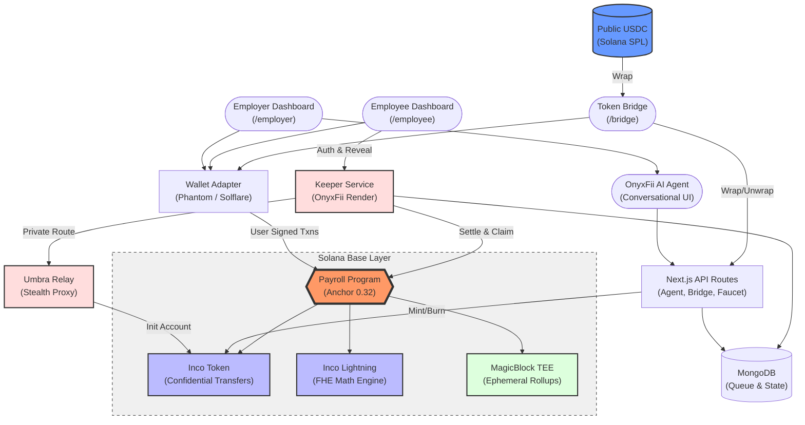
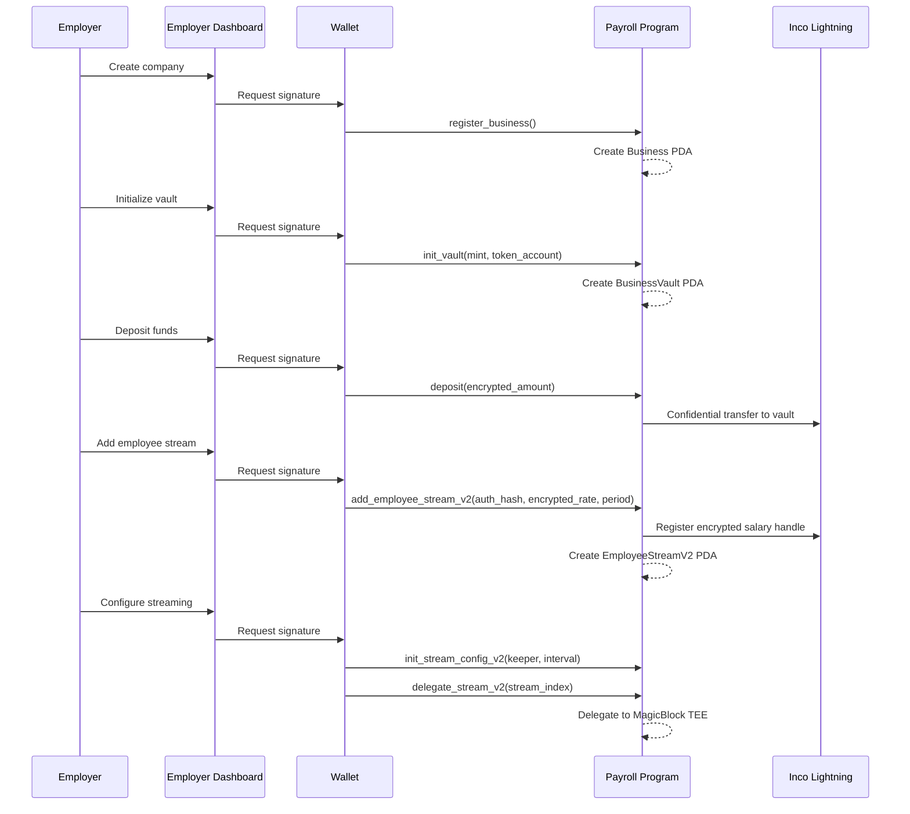
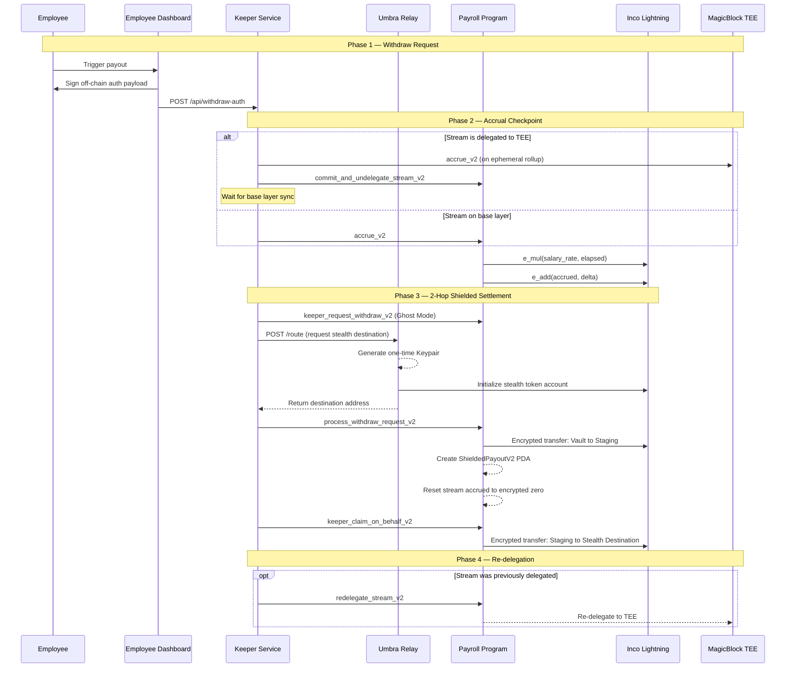
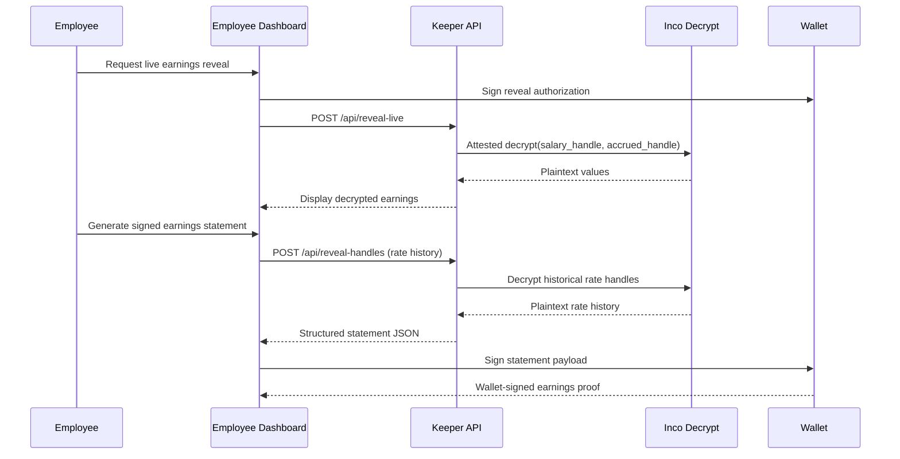
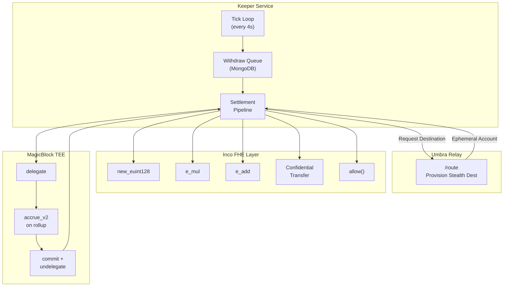
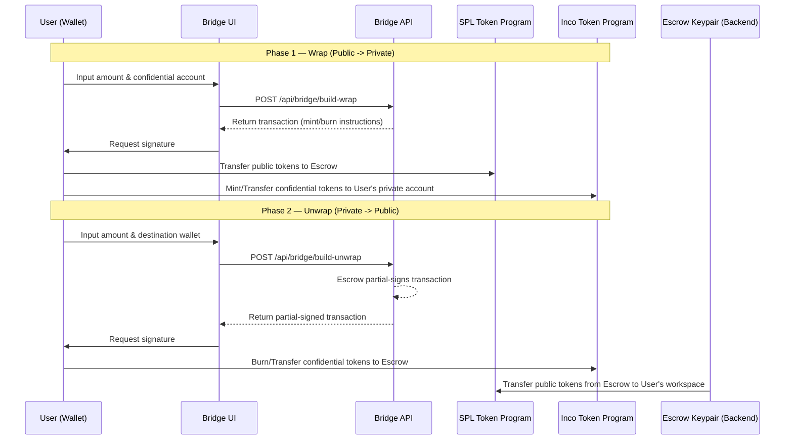
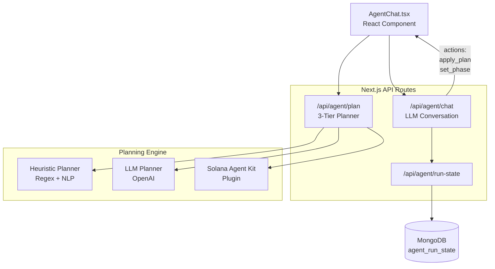
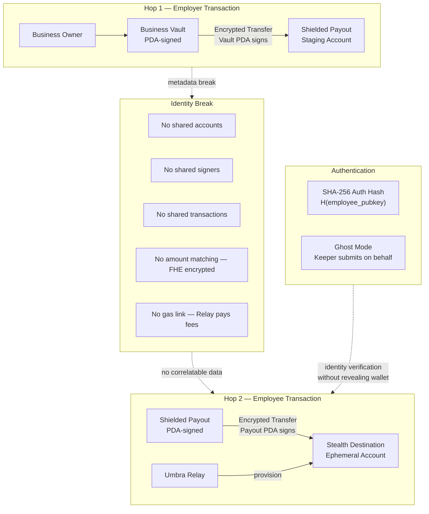
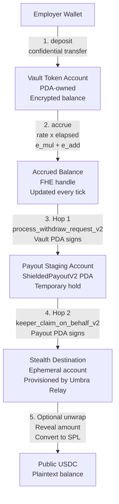
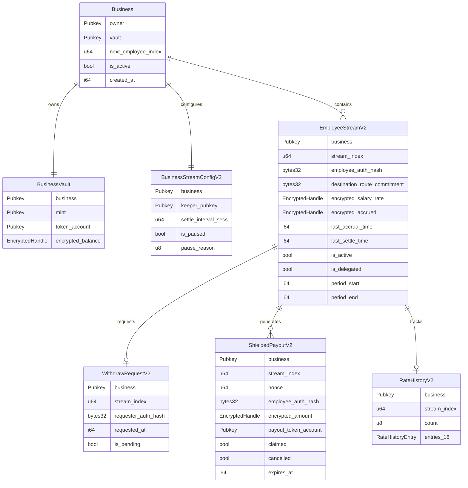

<p align="center">
  <strong>Expensee — OnyxFii</strong>
</p>

<p align="center">
  <em>Private Real-Time Payroll Infrastructure on Solana</em>
</p>

<p align="center">
  <a href="#architecture">Architecture</a> •
  <a href="#privacy-model">Privacy Model</a> •
  <a href="#system-flows">System Flows</a> •
  <a href="#on-chain-program">On-Chain Program</a> •
  <a href="#services">Services</a> •
  <a href="#getting-started">Getting Started</a>
</p>

---

## Overview

**Payroll is broken.** Workers wait weeks to get paid. Salaries are exposed on public blockchains. Cross-border payments eat 3–7% in fees. And compliance is a nightmare.

**Expensee fixes all of it.**

Built on Solana, Expensee is a **confidential streaming payroll protocol** that pays workers every second with fully encrypted compensation. Salary rates, accrued balances, and payout amounts are **never exposed on-chain** — powered by Fully Homomorphic Encryption (Inco Lightning) and Trusted Execution Environments (MagicBlock).

A 2-hop shielded architecture with stealth routing makes employer-to-employee payments **completely untraceable**. An AI co-pilot (OnyxFii Agent) automates the entire setup. An autonomous Keeper service runs settlement 24/7 — zero human intervention.

### What Makes It Different

| | |
|---|---|
| **Encrypted Compensation** | Salary rates and balances stay private via FHE (Inco Lightning) — zero on-chain visibility |
| **Unlinkable Payments** | 2-hop shielded architecture + stealth accounts break all employer↔employee traceability |
| **Real-Time Streaming** | Workers earn every second and withdraw on demand through ephemeral accounts |
| **AI-Powered Setup** | OnyxFii Agent guides employers through payroll configuration conversationally |
| **Autonomous Settlement** | Keeper service handles accrual, routing, and claims without human intervention |

> *Expensee: AI-assisted, private, real-time payroll for the global workforce.*

---

## Why Expensee?

A Web3 startup in Singapore hires a developer in Lagos and a designer in Lisbon. How do they pay them?

**Traditional payroll** means SWIFT transfers that eat 3–7% in fees and take 5 business days. **Crypto payroll** means every salary is public — anyone can see exactly what each worker earns. Neither option works.

**Expensee was built for exactly this problem.**

### The Opportunity

The global payroll industry processes **$75+ billion annually**. Crypto adoption is accelerating, but existing on-chain payroll tools (Superfluid, Sablier, Zebec) only solve streaming — they leave salaries fully public, offer zero privacy, and provide no payment unlinkability. The market gap is massive:

- B2B stablecoin payments surged **733% YoY**, reaching a **$226 Billion** annual run rate in 2025 ([Fireblocks Report](https://www.fireblocks.com/blog/stablecoin-payments-report-2025))
- **25%** of tech/remote companies already pay employees in crypto — stablecoins account for 90%+ of digital salaries ([Triple-A Crypto Ownership Data](https://triple-a.io/cryptocurrency-ownership-data/))
- **75%** of Gen Z workers prefer instant stablecoin pay over traditional 30-day cycles ([Payactiv Workforce Survey](https://www.payactiv.com/blog/earned-wage-access/))
- The remote workforce is projected to reach **93 million workers** in the US alone by 2028 ([Upwork Future Workforce Report](https://www.upwork.com/press/releases/upwork-study-finds-36-million-americans-freelancing))
- Companies offering Earned Wage Access see a **44% reduction in employee turnover** ([Mercator Advisory Group](https://www.mercatoradvisorygroup.com/reports/))

Expensee is the first protocol to combine **real-time streaming + salary encryption + payment unlinkability + AI-powered setup + autonomous settlement** in a single B2B payroll stack.

### Problem 1: Salary Transparency Destroys Companies From the Inside

On a public blockchain, every salary is visible. And inside any company, **salary visibility is the fastest path to chaos**.

When employees discover compensation gaps — even justified ones based on experience, tenure, or performance — it breeds resentment, distrust, and attrition. Bonuses, raises, and equity top-ups become political events instead of private rewards.

**What happens when salaries are public:**

- 😠 **Internal resentment** — Employee A discovers Employee B earns 30% more for similar work. Morale collapses. HR scrambles.
- 🏃 **Retention crisis** — Top performers leave when they learn junior hires negotiated higher packages.
- 💰 **Bonus leaks** — A private performance bonus becomes public knowledge. Now everyone expects one — or feels slighted.
- 🎯 **Raise politics** — Every salary adjustment is visible, turning compensation into office gossip instead of a private matter between employer and employee.

**How Expensee prevents this:**

Every salary rate, accrued balance, and bonus is encrypted using **Fully Homomorphic Encryption** (FHE). Not even the blockchain itself can see the numbers — they're stored as encrypted handles that only authorized parties can decrypt.

- Employee A **cannot** see Employee B's salary — ever
- A private bonus stays **completely invisible** to the rest of the team
- Raises happen silently — no one knows except the employer and the recipient
- The employer controls exactly who can see what, through **programmable view access** that can be granted or revoked at any time

> **Result:** Compensation stays between employer and employee. No politics. No leaks. No chaos.

### Problem 2: Outsiders Can Read Your Entire Payroll

On a public blockchain, it's not just internal — **the entire world** can read your payroll:

- 🕵️ **Competitors** see your exact burn rate, team size, and individual compensation → they poach your talent by outbidding their exact salary
- 📊 **Investors and analysts** reverse-engineer your runway from payment flows
- 🎯 **Bad actors** identify high-earners from wallet balances and target them — digitally or physically
- 🔗 **Every payout** creates a permanent, public, on-chain link between employer wallet and employee wallet — your entire org chart is one block explorer away

**How Expensee makes your payroll invisible:**

| What Outsiders See Today | What They See With Expensee |
|--------------------------|----------------------------|
| Exact salary per employee | Encrypted blob — meaningless without decrypt keys |
| Every employer → employee transaction | Two separate, unrelated transactions (2-hop shielded) |
| Employee wallet receiving salary | A random one-time stealth account (fresh keypair each payout) |
| How much the company is spending | Encrypted vault balance — total spend is hidden |
| Who works for your company | No linkable data — Ghost Mode means employees never sign on-chain |

> **Result:** Your competitors, attackers, and the public see nothing. Zero salary data. Zero org structure. Zero spending visibility.

### Problem 3: Workers Earn Every Second But Get Paid Every 30 Days

Traditional payroll forces a **30-day liquidity gap** on every worker. They generate value from minute one, but only access their earnings weeks later. This is a relic of the paper-check era — and it actively hurts both sides:

- **Workers** take on high-interest debt to cover daily expenses between paychecks
- **Freelancers** chase invoices for 30–90 days before seeing payment
- **Cross-border teams** wait 3–5 business days for SWIFT settlements, losing 3–7% to intermediary fees
- Companies offering Earned Wage Access see **44% less employee churn** — but traditional systems can't deliver it

**How Expensee solves it — from the employee's perspective:**

1. **You earn every second.** Your salary streams continuously in real time — not batch-processed once a month. Open the Employee Dashboard and watch your balance grow live.

2. **Withdraw whenever you want.** Need cash now? Hit withdraw. There's no approval queue, no pay period, no waiting. Your money is your money.

3. **The Keeper handles everything.** You don't have to submit transactions, pay gas, or interact with the blockchain at all. The autonomous Keeper service processes your withdrawal, routes it through a stealth account, and delivers your funds — typically in under 2 minutes.

4. **Your identity stays hidden.** Ghost Mode means the Keeper submits the withdrawal on your behalf. Your wallet never signs on-chain. The Relay pays the gas. Your funds arrive in a **fresh, one-time stealth account** that can't be linked to you, your employer, or any previous payout.

5. **Flexible pay plans.** Hourly, weekly, monthly, fixed-total contracts, or raw per-second streaming — employers choose the plan, and it all streams continuously.

> **Result:** Workers get **real-time financial autonomy** — earn every second, withdraw anytime, with zero blockchain footprint.

### Problem 4: Every Payment Leaves a Permanent Trail

Even with encrypted amounts, traditional crypto payments still leave **metadata trails** — who paid whom, when, and how often. Over time, this metadata is enough to reconstruct your entire payroll graph.

**How Expensee breaks the trail — completely:**

- **2-Hop Shielded Routing** — Every payout splits into two separate transactions: Vault → Staging Account (Hop 1), then Staging → Stealth Destination (Hop 2). No single transaction connects employer to employee.
- **Stealth Accounts** — The Umbra Relay generates a brand-new keypair for every single payout. Even if you withdraw 100 times, each payout goes to a different, unlinkable address.
- **Ghost Mode** — Employees never sign an on-chain transaction. The Keeper submits on their behalf, so the employee wallet has zero on-chain presence.
- **Gas Break** — The Relay pays all account initialization fees. The employee wallet never funds anything — there's no gas trail to follow.
- **No shared accounts, no shared signers, no shared transactions, no amount matching (FHE encrypted), no gas link** — five layers of unlinkability in every payout.

> **Result:** An observer sees encrypted values moving between random, unrelated accounts. No salaries. No amounts. No employer-employee connection. **Complete payment unlinkability.**

### Problem 5: Payroll Shouldn't Need a Human in the Loop

Setting up cross-border encrypted payroll is inherently complex — confidential token accounts, FHE handle registration, keeper authorization, TEE delegation, privacy access grants. Doing it manually is error-prone, slow, and doesn't scale.

**How Expensee automates everything:**

- **OnyxFii AI Agent** — A conversational co-pilot that walks employers through an 11-step setup process in plain English. Say "pay Alice $3000/month" and it handles everything.
- **Autonomous Keeper** — Runs the entire settlement pipeline 24/7 without human intervention: accrue salaries → checkpoint to base layer → settle to shielded staging → route through stealth relay → claim on behalf of employee → re-delegate to TEE. Every ~4 seconds.
- **Zero-touch operations** — Once a payroll stream is live, neither the employer nor the employee needs to do anything. The Keeper handles accrual, withdrawal processing, stealth routing, and re-delegation automatically.

> **Result:** Admin overhead drops **50–70%**, processing costs drop **30–40%**. No intermediary banks. No manual compliance. No human in the loop.

### Who It's For

Expensee is a **B2B payroll infrastructure product**. We sell to companies that pay people — not to individuals.

| B2B Customer | What They Get | How AI Helps |
|-------------|--------------|-------------|
| **Web3 Startups & DAOs** | Private payroll that aligns with crypto-native values — no salary leaks, no org chart exposure | OnyxFii AI Agent sets up encrypted payroll streams in plain English — *"pay Alice $3000/month"* |
| **Remote-First Companies** | Instant global payouts to 190+ countries — no SWIFT, no 5-day waits, no 3–7% fees | AI agent handles multi-jurisdiction configurations and guides through every wallet approval step |
| **Staffing Agencies & B2B** | Manage hundreds of contractor streams — 80–90% fewer manual errors, scales without headcount | Conversational chat interface replaces complex admin dashboards — zero training needed |
| **Freelance Marketplaces** | Offer real-time Earned Wage Access as a platform feature — attract and retain top talent | AI-powered onboarding lets platform operators spin up private payroll streams in minutes |

**For employees and contractors** (the end users), the experience is simple: earn every second, withdraw on demand, and your identity stays completely private. They never interact with the blockchain — the Keeper and AI Agent handle everything.

### Why This Stack?

Every technology choice in Expensee was made to solve a specific payroll problem. Here's why:

| Technology | What It Is | Why We Chose It |
|------------|-----------|----------------|
| **Solana** | High-throughput L1 blockchain | Sub-second finality and ~$0.001 transaction costs make per-second salary streaming economically viable. You can't stream salaries on a chain where each accrual costs $5 in gas. |
| **Inco Lightning** | Fully Homomorphic Encryption (FHE) engine on Solana | The only way to do **math on encrypted data** without decrypting it. Salary accrual (`rate × time`) must happen on-chain without revealing the rate or the result. ZK proofs can verify, but only FHE can *compute*. |
| **MagicBlock** | Trusted Execution Environment (TEE) via Ephemeral Rollups | FHE operations on base-layer Solana have higher latency. MagicBlock delegates stream accounts to a TEE that accrues in real-time (~10ms ticks) inside an Intel TDX enclave — then commits state back to L1. This gives us real-time streaming without sacrificing privacy. |
| **Umbra Relay** | Stealth address provisioning service | Encrypting amounts isn't enough — if the same wallet receives every payout, observers can still build a payment graph from metadata. Umbra generates a fresh one-time keypair per payout, breaking address linkability completely. |
| **OnyxFii AI Agent** | LLM-powered conversational payroll assistant | Employers shouldn't need to understand PDAs, FHE handles, or keeper configs. The AI agent parses natural language (*"pay 0x... $5000/month"*), extracts structured plans via a 3-tier planner (heuristic → LLM → Solana Agent Kit), and walks users through each step with wallet approvals. Multi-provider fallback (OpenRouter → Gemini → Groq) ensures 24/7 availability. |
| **MongoDB** | Document database for off-chain state | Withdraw queues, AI agent conversation state, and keeper operational data need fast reads/writes that don't belong on-chain. MongoDB handles the off-chain coordination layer. |
| **Anchor 0.32** | Solana smart contract framework | Required for MagicBlock's `#[ephemeral]` macro and delegation SDK. Also provides type-safe PDA derivation and CPI builders for Inco Lightning integration. |


---

## OnyxFii AI Agent

OnyxFii is the world's first **autonomous payroll co-pilot**. It eliminates the complexity of on-chain privacy by providing a chat-first interface that handles configuration, deployment, and real-time monitoring.

### 11-Step Guided Setup
The agent follows a rigorous compliance and technical checklist to ensure payroll is configured correctly. It cross-references natural language intents with live on-chain account data:

1. **Verify Wallet** — Ensure employer wallet is connected and has sufficient SOL for gas.
2. **Register Business** — Initialize the Business PDA on Solana.
3. **Setup Token Mint** — Configure the payment token (e.g., payUSD or USDC).
4. **Initialize Vault** — Create the encrypted BusinessVault PDA.
5. **Deposit Funds** — Guide the user through the encrypted deposit process.
6. **Set Stream Config** — Define keeper authorization and settlement intervals.
7. **Add Employees** — Parse employee wallet/hash and define salary rates.
8. **Grant Privacy Access** — Execute the Inco Lightning "allow" instruction for the employee and keeper.
9. **Verify FHE Handles** — Confirm salary handles are properly initialized as ciphertexts.
10. **Enable TEE Streaming** — Delegate streams to MagicBlock Private Ephemeral Rollups.
11. **Authorize Keeper** — Activate the autonomous settlement loop.

### Multi-Tier Planning Engine
OnyxFii doesn't just "chat"; it builds structured execution plans. It uses a 3-tier analysis to extract payroll logic from human speech:
- **Tier 1: Heuristic Filter** — Identifies addresses and decimal rates using regex and known schema patterns.
- **Tier 2: LLM Extraction** — Uses deep reasoning to map complex sentences (*"pay Alice $50k/yr until December"*) into structured JSON objects.
- **Tier 3: Solana Agent Kit** — Verifies liquidity, account math, and PDA feasibility before proposing a transaction.

### Autonomous Coordination
Once the payroll is live, the AI Agent stays in sync with the **Keeper Service**. It provides a real-time "Readiness Grid" in the UI, showing the status of FHE handles, TEE delegation, and settlement health. If a stream stalls or a vault runs low, the agent proactively notifies the employer in the chat.

---

## Architecture

### High-Level System Architecture



### Component Summary

| Component | Technology | Lines | Role |
|-----------|-----------|-------|------|
| **Payroll Program** | **Solana** (Rust · Anchor 0.32) | ~4,000 | On-chain state machine on Solana: business/vault/stream PDAs, FHE operations |
| **Keeper Service** | TypeScript · Node.js | ~4,300 | Off-chain orchestrator: withdraw queue processing, accrual, settlement, claim relay |
| **Umbra Relay** | Node.js (CJS) | ~430 | Stealth destination provisioning: creates ephemeral token accounts per payout |
| **OnyxFii AI Agent** | Next.js APIs + React | ~2,500 | Conversational payroll assistant: multi-step guided setup, LLM planner, execution state |
| **Token Bridge** | Next.js + Smart Contracts | ~400 | Wrap/unwrap interface converting standard SPL tokens to/from confidential Inco tokens |
| **Frontend** | Next.js · React · Tailwind | ~11,300 | Employer/Employee dashboards, AI agent chat, bridge UI, theme system |
| **Landing Page** | Next.js 16 · React Three Fiber · Framer Motion | ~2,500 | Marketing site with 3D globe, holographic cards, particle effects, FAQ, social proof |
| **Inco Lightning** | Solana Program | — | Fully Homomorphic Encryption engine for encrypted arithmetic |
| **Inco Token Program** | Solana Program | — | Confidential token transfers with encrypted balances |
| **MagicBlock ER** | Solana TEE | — | Ephemeral Rollups for delegated real-time execution |

---

## System Flows

### 1. Employer Setup



### 2. Private Payout Pipeline (Core Engine)



### 3. Employee Earnings Reveal and Signed Statement



### 4. Keeper Interaction Model



### 5. Cross-Chain Token Bridge (Wrap/Unwrap)



---

## AI-Assisted Payroll Setup (OnyxFii Agent)

The Employer Dashboard includes an **AI-powered conversational assistant** called OnyxFii Agent that guides employers through the entire payroll setup process.

### Architecture



### Guided Setup Flow

The agent walks employers through a **4-phase, 11-step** setup process:

| Phase | Steps | What Happens |
|-------|-------|-------------|
| **1. Foundation** | Register Business, Create Payroll Wallet, Initialize Vault | Creates the on-chain business entity and encrypted token vault |
| **2. Funding** | Deposit Funds | Transfers encrypted tokens into the business vault |
| **3. Worker Setup** | Init Automation, Create Worker Destination, Configure Record, Create Payroll Record | Sets up keeper, creates employee stream with encrypted salary rate |
| **4. High-Speed** *(optional)* | Delegate to MagicBlock TEE | Enables real-time accrual via ephemeral rollups |

### Planning Engine (3-Tier)

The planner uses a **cascading strategy** to extract structured payroll plans from natural language:

1. **Heuristic Planner** — Fast regex/NLP extraction for common patterns ("pay Alice $5000/month")
2. **LLM Planner** — Falls back to OpenAI for complex or ambiguous instructions
3. **Solana Agent Kit** — Plugin-based execution via `solana-agent-kit` for on-chain actions

### Key Design Decisions

- **Wallet-Gated Execution**: The agent **never bypasses wallet approvals**. It prepares transactions and asks the user to type "go" to sign.
- **Blockchain-Aware Context**: Every message includes live on-chain state (business exists? vault funded? streams active?) so the agent never guesses.
- **Run-State Persistence**: Multi-step execution state is saved to MongoDB, allowing the employer to resume setup across sessions.
- **Pay Presets**: Supports `per_second`, `hourly`, `weekly`, `monthly`, and `fixed_total` salary configurations.

### Agent Capabilities

| Capability | Description |
|-----------|-------------|
| **Conversational Setup** | Natural language payroll configuration — "pay 0x... $3000 per month" |
| **Plan Extraction** | Parses wallet addresses, pay amounts, presets, and periods from free text |
| **Step Guidance** | Tracks current step, shows reasoning, provides Solscan proof links |
| **Action Dispatch** | Emits `apply_plan` and `set_phase` actions to drive the UI state machine |
| **Error Recovery** | Detects invalid wallets, missing fields, and guides correction |
| **Bonus and Deposit** | Handles one-off bonus grants and vault top-ups via chat |
| **Rate History** | Initiates rate history for selective disclosure payslips |

---

## Privacy Model

### What Is Encrypted (Never Visible On-Chain)

| Data | Protection | Mechanism |
|------|-----------|-----------|
| Salary rates | FHE-encrypted 128-bit handles | `inco_new_euint128` via Inco Lightning |
| Accrued balances | FHE-encrypted 128-bit handles | Homomorphic `e_mul` + `e_add` operations |
| Payout amounts | FHE-encrypted transfers | Inco Token Program confidential transfer |
| Token balances | Encrypted at rest | Inco Token account encryption |

### How Linkability Is Broken



| Privacy Layer | Technique | Effect |
|--------------|-----------|--------|
| **Identity decoupling** | SHA-256 auth hash commitments | Employee wallet never stored on-chain — only `H(pubkey)` |
| **2-hop settlement** | Vault → Staging → Destination | No single transaction links employer to employee |
| **Stealth destinations** | Umbra Relay one-time accounts | Fresh keypair per payout — unlinkable across withdrawals |
| **Gas funding break** | Relay pays account init fees | Employee wallet never funds the destination account |
| **Amount obfuscation** | FHE-encrypted transfers | External observers cannot match amounts across hops |
| **Ghost Mode** | `keeper_request_withdraw_v2` | Employee never signs on-chain — keeper submits on their behalf |
| **Programmable viewing** | `grant/revoke_view_access_v2` | Selective disclosure to employees, auditors, or keepers |

### What Remains Public (By Design)

- Employer wallet address and business PDAs
- Keeper wallet and operational activity (transaction hashes, timestamps)
- Stream lifecycle state flags (`is_active`, `is_delegated`, `is_paused`)
- Payout lifecycle flags (`claimed`, `cancelled`, `expires_at`)

### Encrypted Token Flow



### Access Control Matrix

| Role | Salary Rate | Accrued Balance | Payout Amount | Rate History | How Access Is Granted |
|------|:-----------:|:---------------:|:-------------:|:------------:|----------------------|
| **Business Owner** | Yes | Yes | Yes | Yes | Inherent (creator of handles) |
| **Employee** | Yes | Yes | No | Yes | `grant_employee_view_access_v2` |
| **Keeper** | Yes | No | No | No | `grant_keeper_view_access_v2` |
| **Auditor** | Yes | Yes | No | No | `grant_auditor_view_access_v2` |
| **Public** | No | No | No | No | N/A — sees only opaque Solana FHE handles |

> **Key Principle:** Access is **opt-in** and **revocable**. The business owner must explicitly grant decrypt permission via Inco Lightning's `allow()` CPI. Any grant can be revoked at any time via `revoke_view_access_v2`.

---

## Solana On-Chain Program

**Program ID:** `3P3tYHEUykB2fH5vxpunHQH3C7zi9B3fFXyzaRP38bJn`
**Framework:** Anchor 0.32.1 · Rust · ~4,000 lines

### Account Architecture



### Instruction Set (28 Instructions)

| Category | Instruction | Description |
|----------|------------|-------------|
| **Setup** | `register_business` | Create Business PDA for owner |
| | `init_vault` | Create BusinessVault PDA, link Inco token account |
| | `rotate_vault_token_account` | Hot-swap vault's token account and mint |
| | `init_stream_config_v2` | Configure keeper, settle interval |
| | `update_keeper_v2` | Rotate authorized keeper wallet |
| **Funding** | `deposit` | Encrypted transfer into vault via Inco CPI |
| | `admin_withdraw_vault_v2` | Owner pulls unused funds from vault |
| **Streaming** | `add_employee_stream_v2` | Create stream with auth hash + encrypted rate |
| | `accrue_v2` | FHE: `accrued += salary_rate x elapsed` |
| | `update_salary_rate_v2` | Change rate (accrue first, then swap handle) |
| | `grant_bonus_v2` | Add encrypted bonus to accrued balance |
| | `auto_settle_stream_v2` | Settle accrued to destination (legacy path) |
| **Delegation** | `delegate_stream_v2` | Delegate stream to MagicBlock TEE |
| | `commit_and_undelegate_stream_v2` | Return stream to base layer |
| | `redelegate_stream_v2` | Re-delegate after settlement |
| **Payout** | `request_withdraw_v2` | Employee requests withdrawal (signs on-chain) |
| | `keeper_request_withdraw_v2` | Ghost Mode: keeper requests on behalf |
| | `process_withdraw_request_v2` | Hop 1: vault to shielded staging account |
| | `claim_payout_v2` | Hop 2: employee claims directly |
| | `keeper_claim_on_behalf_v2` | Hop 2: keeper claims with Ed25519 auth |
| | `cancel_expired_payout_v2` | Return expired unclaimed funds to vault |
| **Access** | `grant_employee_view_access_v2` | Allow employee to decrypt their handles |
| | `grant_keeper_view_access_v2` | Allow keeper to decrypt salary rate |
| | `grant_auditor_view_access_v2` | Allow auditor to read salary + accrued |
| | `revoke_view_access_v2` | Revoke any wallet's decrypt permission |
| **Control** | `pause_stream_v2` | Pause all streams (manual or compliance) |
| | `resume_stream_v2` | Resume paused streams |
| | `deactivate_stream_v2` | Permanently stop a single stream |
| | `init_rate_history_v2` | Initialize rate audit trail for payslips |

### PDA Derivation Map

```
Business           -> ["business", owner]
BusinessVault      -> ["vault", business]
StreamConfigV2     -> ["stream_config_v2", business]
EmployeeStreamV2   -> ["employee_v2", business, stream_index]
WithdrawRequestV2  -> ["withdraw_request_v2", business, stream_index]
ShieldedPayoutV2   -> ["shielded_payout", business, stream_index, nonce]
RateHistoryV2      -> ["rate_history_v2", business, stream_index]
```

---

## Services

### Keeper Service (`backend/keeper/`)

The Keeper is a **4,300-line TypeScript service** that automates the entire payout lifecycle.

**Core Responsibilities:**
- Poll for pending `WithdrawRequestV2` accounts on-chain
- Checkpoint accruals via `accrue_v2` (handling TEE delegation transparently)
- Execute the 2-hop settlement: `process_withdraw_request_v2` then `keeper_claim_on_behalf_v2`
- Route through the Umbra Relay for stealth destination provisioning
- Re-delegate streams back to MagicBlock TEE after settlement
- Expose REST API for employee withdraw-auth, reveal, and health

**Key Capabilities:**
| Feature | Description |
|---------|-------------|
| **Privacy Payout Route** | `enforced` / `optional` / `off` — controls whether stealth routing is mandatory |
| **Ghost Mode** | Keeper submits withdrawals on behalf of employees — no employee on-chain signature |
| **Server Decrypt** | Attested decrypt via Inco for employee earnings reveals |
| **Dead Letter Queue** | Failed payouts logged to `dead-letter.log` with full context |
| **Compliance Controls** | Optional pause/resume with Range Protocol integration |
| **Auto Re-delegation** | Streams automatically re-delegated to TEE after settlement |

### Umbra Relay (`services/umbra-relay/`)

A **424-line Node.js service** that provides stealth destination routing.

**Modes:**
| Mode | Behavior |
|------|----------|
| `destination` | Return a configured static destination account |
| `defer` | Accept route, defer claim to later |
| `umbra-network` | Forward signed transactions to the global Umbra relayer network |

**Key Feature — One-Time Destination Provisioning:**
When enabled (`UMBRA_RELAY_PROVISION_ONE_TIME_DESTINATION=true`), the relay:
1. Generates a fresh `Keypair` for each payout
2. Initializes a new Inco Token account on-chain (relay pays the SOL)
3. Returns the ephemeral account address to the Keeper
4. Uses a random owner per route for maximum unlinkability

---


## Deployed Addresses (Devnet)

| Contract | Address |
| :--- | :--- |
| **Payroll Program** | `3P3tYHEUykB2fH5vxpunHQH3C7zi9B3fFXyzaRP38bJn` |
| **Inco Lightning** | `5sjEbPiqgZrYwR31ahR6Uk9wf5awoX61YGg7jExQSwaj` |
| **Inco Token Program** | `4cyJHzecVWuU2xux6bCAPAhALKQT8woBh4Vx3AGEGe5N` |
| **MagicBlock Del.** | `DELeGGvXpWV2fqJUhqcF5ZSYMS4JTLjteaAMARRSaeSh` |
| **Confidential Mint** | `4FVrXQpUPFKMtR2bzfpu4idGJZSb9s7dqvfd2whZnRDJ` |
| **pUSDC (Public USDC)** | `FVoBx16c9JtsV94oS27yzJDr6q9DJNSWxjX3beN5PpnA` |


## Getting Started

### Prerequisites

- **Node.js** 18+
- **Solana CLI** with a devnet wallet keypair
- **Anchor CLI** 0.32.1 (for program builds)
- **Devnet SOL** in employer, employee, keeper, and relay wallets

### 1. Install Dependencies

```bash
# Root (program + shared deps)
npm install

# Frontend
cd frontend && npm install && cd ..

# Keeper
cd backend/keeper && npm install && cd ../..
```

### 2. Configure Environment

Copy and customize these files:

```bash
cp frontend/.env.local.example frontend/.env.local
cp backend/keeper/.env.example backend/keeper/.env
cp services/umbra-relay/.env.example services/umbra-relay/.env
```

**Critical configuration flags:**

| File | Variable | Value | Purpose |
| :--- | :--- | :--- | :--- |
| `frontend/.env.local` | `NEXT_PUBLIC_KEEPER_API_URL` | `https://onyxfii.onrender.com` | Production API endpoint |
| `frontend/.env.local` | `NEXT_PUBLIC_KEEPER_SERVER_DECRYPT` | `true` | Enable employee reveals |
| `backend/keeper/.env` | `KEEPER_PRIVACY_PAYOUT_ROUTE_MODE` | `enforced` | Mandate stealth routing |
| `backend/keeper/.env` | `KEEPER_UMBRA_RELAY_URL` | `https://onyxfii-relay.onrender.com` | Production Relay endpoint |
| `backend/keeper/.env` | `KEEPER_ENABLE_SERVER_DECRYPT` | `true` | Enable attested decrypt |
| `services/umbra-relay/.env` | `UMBRA_RELAY_PROVISION_ONE_TIME_DESTINATION` | `true` | Enable stealth accounts |

### 3. Run Services (3 Terminals)

**Terminal 1 — Umbra Relay:**
```bash
set -a && source services/umbra-relay/.env && set +a
npm run umbra:relay:dev
```

**Terminal 2 — Keeper:**
```bash
npm run keeper:dev
```

**Terminal 3 — Frontend:**
```bash
cd frontend && npm run dev
```

### 4. Verify Health

```bash
# Verify Health (Production)
curl -s https://onyxfii-relay.onrender.com/health  # Relay
curl -s https://onyxfii.onrender.com/health        # Keeper
```

### 5. Demo Walkthrough

1. **Employer:** Connect wallet, create company, initialize vault, deposit funds
2. **Employer:** Create private payroll stream (encrypted salary rate)
3. **Employer:** Grant keeper view access, delegate stream to TEE
4. **Employee:** Connect wallet, view encrypted stream, request payout
5. **Keeper:** Automatically processes: accrue, undelegate, settle, route, claim, re-delegate
6. **Employee:** Reveal live earnings, generate wallet-signed earnings statement
7. **Optional:** Unwrap confidential tokens on the Bridge page


---


## Repository Structure

```
expensee/
├── programs/payroll/            # Anchor program (Rust)
│   └── src/
│       ├── lib.rs               # 28 instructions (~2,082 lines)
│       ├── state/               # Account structs (Business, Employee, Vault, Payout, ...)
│       │   ├── business.rs      # Business + BusinessVault state
│       │   ├── employee.rs      # EmployeeStreamV2 state
│       │   ├── stream_config.rs # BusinessStreamConfigV2 state
│       │   ├── shielded_payout.rs # ShieldedPayoutV2 state
│       │   └── withdraw.rs      # WithdrawRequestV2 state
│       ├── contexts.rs          # Anchor account contexts (~1,072 lines)
│       ├── constants.rs         # PDA seeds, program IDs, limits
│       ├── errors.rs            # 30+ error codes
│       ├── events.rs            # On-chain event emissions
│       └── helpers.rs           # Inco CPI builders, FHE utilities
│
├── backend/keeper/              # Keeper automation service (TypeScript)
│   └── src/
│       ├── index.ts             # Main entry: worker loop + REST API (~3,255 lines)
│       ├── claims-queue.ts      # MongoDB-backed withdraw queue (~324 lines)
│       └── healthcheck.ts       # Health + relay API server (~703 lines)
│
├── services/umbra-relay/        # Stealth routing relay (Node.js)
│   ├── server.cjs               # Relay server (~430 lines)
│   ├── self-test.cjs            # Self-test suite
│   └── .env.example             # Configuration reference
│
├── frontend/                    # Next.js application
│   ├── pages/
│   │   ├── employer.tsx         # Employer dashboard (~4,415 lines)
│   │   ├── employee.tsx         # Employee dashboard (~1,911 lines)
│   │   ├── bridge.tsx           # Token wrap/unwrap bridge (~421 lines)
│   │   └── api/
│   │       ├── agent/           # chat.ts, plan.ts, run-state.ts
│   │       ├── bridge/          # build-wrap.ts, build-unwrap.ts, submit-unwrap.ts
│   │       ├── faucet/          # mint-payusd.ts, mint-usdc.ts
│   │       ├── inco/            # Inco integration endpoints
│   │       └── magicblock/      # delegation-status.ts, account-info.ts
│   ├── components/
│   │   ├── AgentChat.tsx        # AI conversational assistant (~967 lines)
│   │   ├── PageShell.tsx        # Shared layout shell
│   │   ├── ThemeToggle.tsx      # Light/dark mode toggle
│   │   ├── Logo.tsx             # Brand logo component
│   │   ├── StepCard.tsx         # Setup step cards
│   │   ├── StatusPill.tsx       # Status indicator badges
│   │   └── ...                  # ActionResult, AdvancedDetails, InlineHelp, WalletButton
│   ├── contexts/
│   │   └── ThemeContext.tsx     # Light/dark theme provider
│   └── lib/
│       ├── payroll-client.ts    # Solana payroll SDK (~2,617 lines)
│       ├── range.ts             # Range Protocol compliance (~485 lines)
│       ├── magicblock.ts        # MagicBlock TEE helpers
│       ├── copy.ts              # Clipboard utilities
│       └── ui-state.ts          # UI state management
│
├── landingpage/                 # Marketing landing page (Next.js 16)
│   ├── app/
│   │   ├── page.tsx             # Main landing page
│   │   ├── layout.tsx           # Root layout + metadata
│   │   └── globals.css          # Global styles
│   └── components/
│       ├── Hero.tsx             # Hero section with phone mockup
│       ├── Globe.tsx            # 3D globe (React Three Fiber)
│       ├── AgenticStream.tsx    # Streaming visualization
│       ├── HolographicCard.tsx  # Glassmorphism card effects
│       ├── HolographicShield.tsx # Shield animation
│       ├── ParticleMesh.tsx     # Particle background effects
│       ├── SecurityInterface.tsx # Security features display
│       ├── TextScramble.tsx     # Text scramble animation
│       ├── Benefits.tsx         # Benefits section
│       ├── CompareCards.tsx     # Comparison cards
│       ├── GlobalScale.tsx      # Global scale metrics
│       ├── SocialProof.tsx      # Social proof / testimonials
│       ├── FAQ.tsx              # Frequently asked questions
│       ├── Footer.tsx           # Site footer
│       ├── Navbar.tsx           # Navigation bar
│       ├── Logo.tsx             # Logo component
│       └── Logos.tsx            # Partner/integration logos
│
├── docs/                        # Runbooks and rollout documentation
│   ├── HOW_IT_WORKS.md          # Detailed architecture guide
│   ├── runbook-v2.md            # Operations runbook
│   ├── demo-checklist-devnet.md # Devnet demo checklist
│   ├── public-entry-exit-demo.md # Public entry/exit flow demo
│   └── umbra-hybrid-rollout.md  # Umbra hybrid rollout plan
│
├── tests/                       # Integration tests
│   ├── payroll.ts               # Core payroll test suite
│   └── shielded-payout.ts       # Shielded payout test suite
│
├── scripts/                     # Utility scripts
│   └── create-new-mint.ts       # Mint creation helper
│
├── keys/                        # Wallet keypairs (gitignored)
├── Anchor.toml                  # Anchor configuration
├── Cargo.toml                   # Rust workspace config
├── rust-toolchain.toml          # Rust toolchain pinning
└── package.json                 # Root scripts and dependencies
```


---


## Additional Documentation

| Document | Path |
|----------|------|
| How It Works (Architecture) | `docs/HOW_IT_WORKS.md` |
| Operations Runbook | `docs/runbook-v2.md` |
| Devnet Demo Checklist | `docs/demo-checklist-devnet.md` |
| Public Entry/Exit Demo | `docs/public-entry-exit-demo.md` |
| Umbra Hybrid Rollout | `docs/umbra-hybrid-rollout.md` |
| Keeper README | `backend/keeper/README.md` |
| Frontend README | `frontend/README.md` |
| Landing Page README | `landingpage/README.md` |


---


## Known Limitations

- This is currently a **hardened, production-ready devnet infrastructure**, audited for privacy enforcement.
- Public Umbra network forwarding requires the official SDK (currently private/unreleased).
- Operational metadata (wallet addresses, timestamps, tx hashes) remains publicly visible by design.
- Legacy streams created before strict privacy mode may carry additional linkability.
- FHE operations on Inco Lightning have higher latency than native Solana instructions.


---


<p align="center">
  <strong>Expensee — Private, practical, real-time payroll infrastructure on Solana.</strong>
</p>
