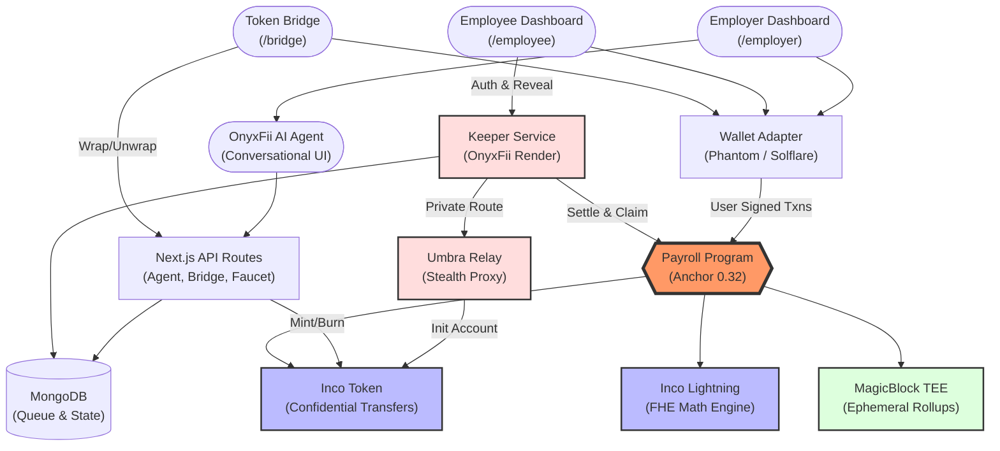
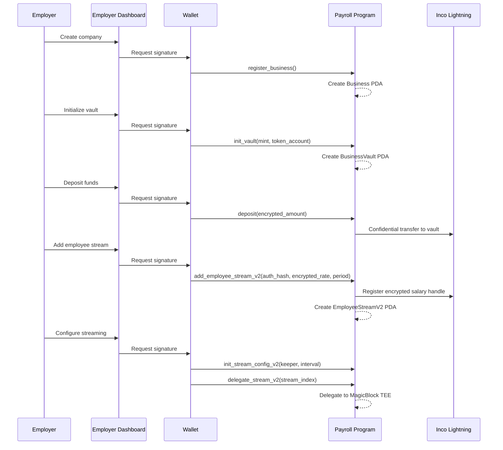
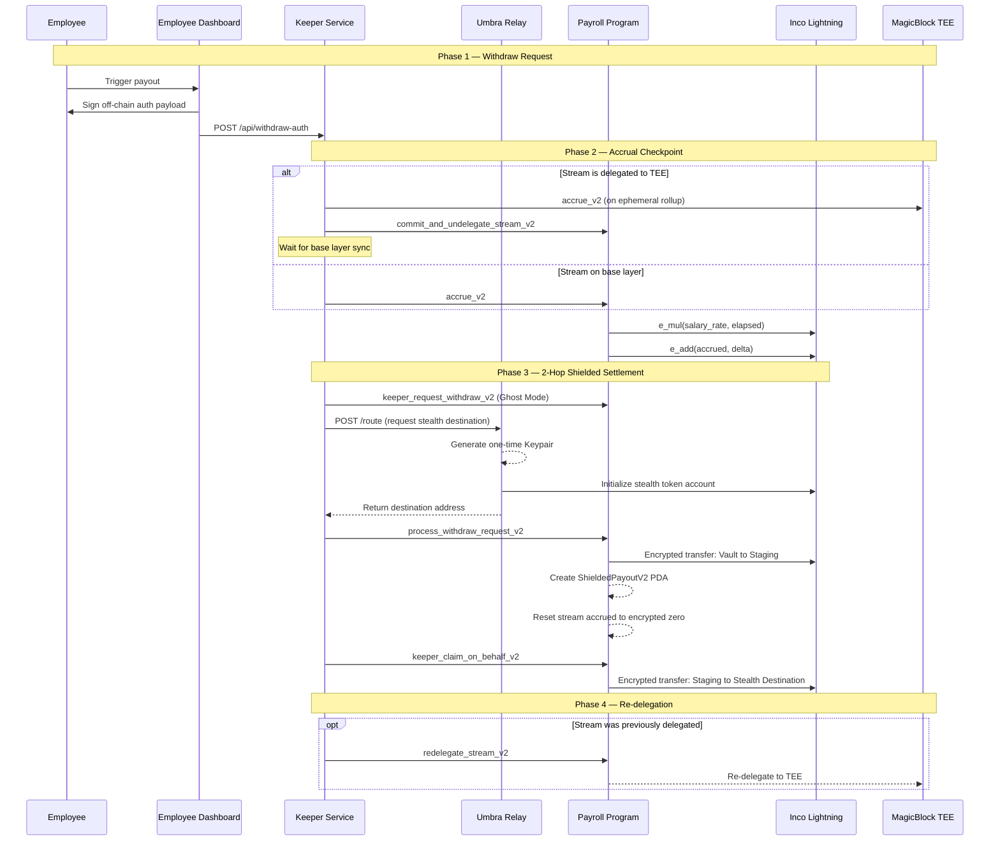
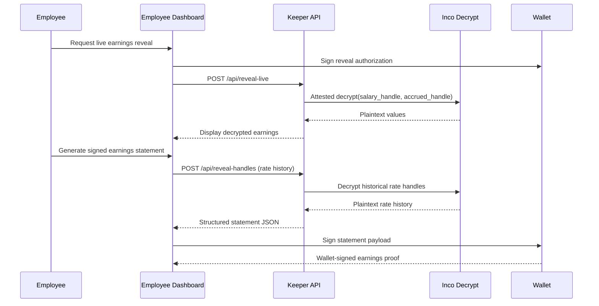
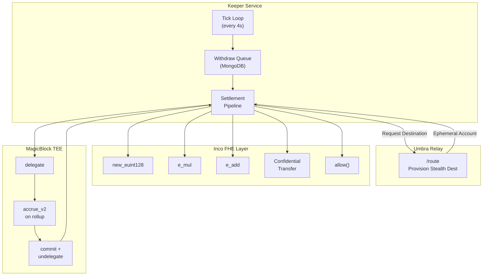
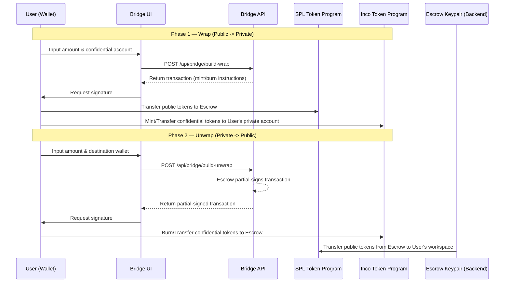
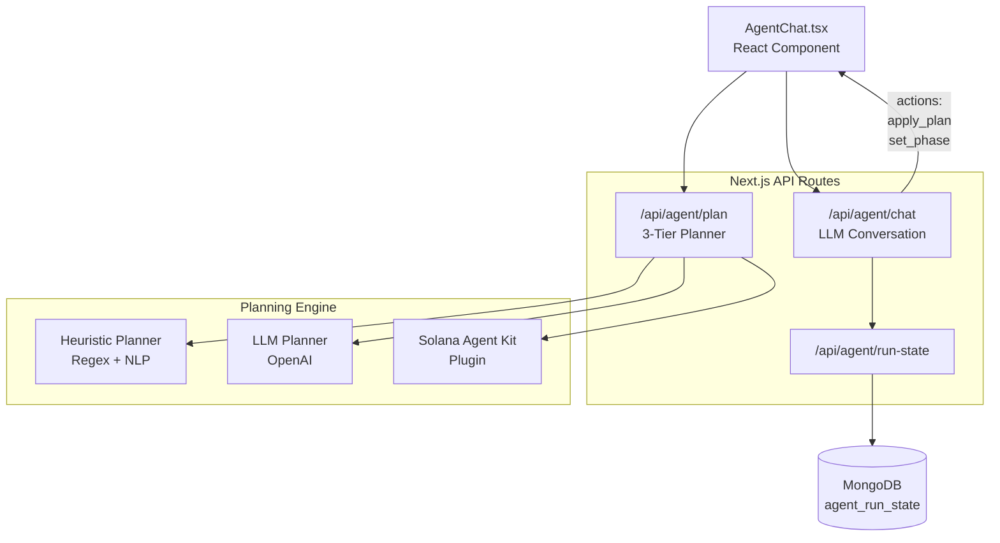
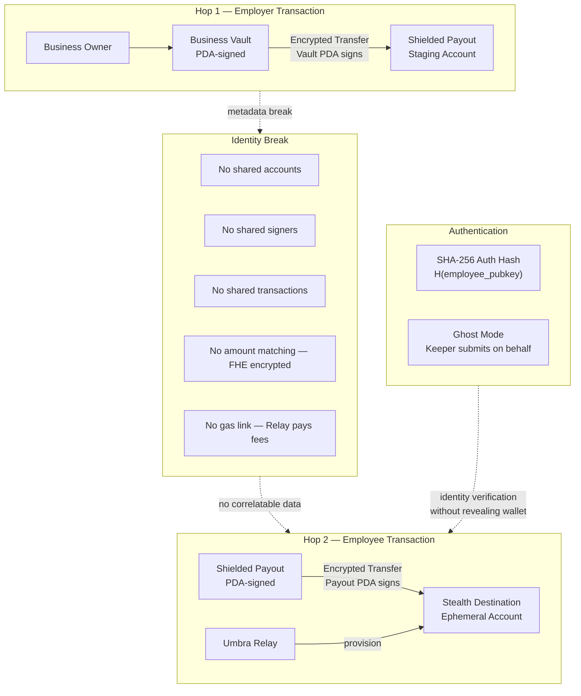
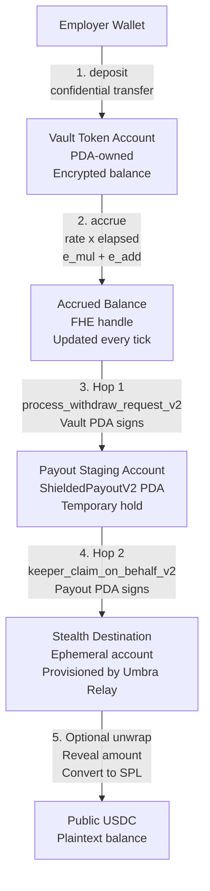
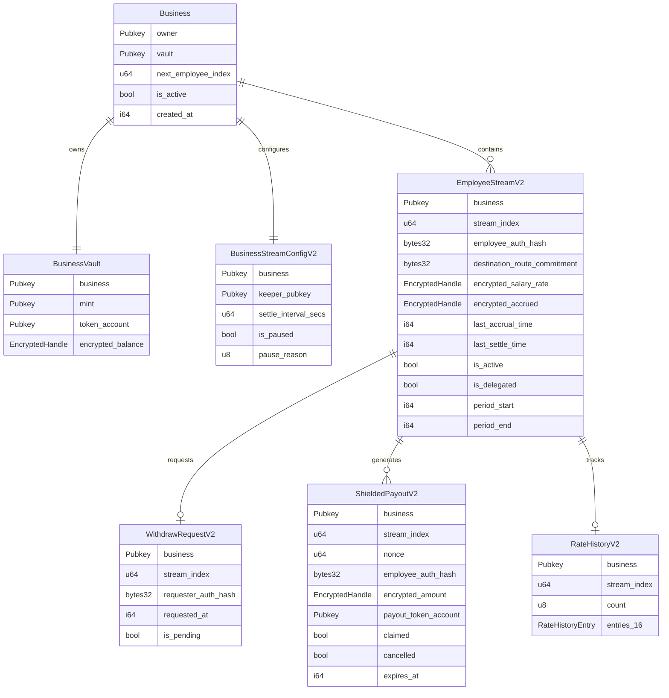

<p align="center">
  <strong>Expensee — OnyxFii</strong>
</p>

<p align="center">
  <em>Private Real-Time Payroll Infrastructure on Solana</em>
</p>

<p align="center">
  <a href="#architecture">Architecture</a> •
  <a href="#privacy-model">Privacy Model</a> •
  <a href="#system-flows">System Flows</a> •
  <a href="#on-chain-program">On-Chain Program</a> •
  <a href="#services">Services</a> •
  <a href="#getting-started">Getting Started</a>
</p>

---

## Overview

Expensee is a **confidential streaming payroll protocol** built on Solana. It combines **Fully Homomorphic Encryption** (Inco Lightning), **Trusted Execution Environments** (MagicBlock), and **Agentic AI** to deliver a payroll system where:

- Salary rates and accrued balances are **never visible on-chain** — all arithmetic happens on encrypted handles.
- Employer-to-employee payment links are **broken at the protocol level** using a 2-hop shielded architecture.
- Employees can **withdraw on-demand** and receive funds through ephemeral stealth accounts.
- An **OnyxFii AI Agent** acts as a compliance co-pilot, guiding employers through global payout setups.
- An automated **Keeper service** orchestrates the entire settlement pipeline without human intervention.

> **Elevator Pitch:**
> Expensee is an AI-assisted, private, real-time payroll stack for Web3 and remote startups.
> It keeps salaries encrypted, automates setup via AI agents, and eliminates direct payer-receiver traceability through a 2-hop shielded payout model with stealth routing.

---

## Why Expensee? (The Market Thesis)

For **Web3 startups, remote agencies, and gig platforms**, traditional 30-day fiat payroll cycles are fundamentally broken. Expensee replaces this analog friction with a comprehensive Web3 payroll stack designed for the "global-by-default" economy.

### The Pain Points We Solve
The current financial system penalizes global, digital-first teams:
1. **The "Inflation-Liquidity" Trap:** Traditional bi-weekly pay forces digital-native workers into high-interest debt to cover daily expenses. 75% of Gen Z workers now prefer stablecoin options for instant liquidity.
2. **The "Border Friction" Tax:** SWIFT transfers lose 3% to 7% in fees and take 3–5 business days to arrive, crippling remote startups operating across borders.
3. **The "Surveillance" Vulnerability:** Purely public blockchains expose a worker’s exact salary and net worth to the world, creating extreme physical and digital risks.
4. **The "Compliance Complexity" Ceiling:** Navigating fragmented tax/labor laws makes global hiring impossible for small startups without massive legal overhead.

### Target Market & TAM (Web3 & Remote Ecosystems)
We are not targeting traditional corporate payroll; we are targeting the rapidly expanding frontier of digital-native work.
- **The B2B Stablecoin Market:** B2B stablecoin payments surged 733% year-over-year, reaching a **$226 Billion** annual run rate in 2025. This is our immediate addressable liquidity pool.
- **Crypto-Native Adoption:** 25% of modern tech/remote companies worldwide already pay employees in cryptocurrency, with stablecoins (primarily USDC) accounting for over 90% of digital salaries.
- **Target Customers:** Web3 Startups, DAO Contributors, International Freelance Marketplaces, and Remote-First Agencies.

### The Strategic Solution
Expensee shifts payroll from a slow administrative burden into a competitive advantage:

#### 1. Instant Global Liquidity (Earned Wage Access)
Waiting weeks for a paycheck is obsolete. Stablecoin payouts settle across 190+ countries in under 2 minutes, 24/7. Companies offering this Earned Wage Access see a **44% reduction in employee churn**.

#### 2. Institutional-Grade Privacy
Expensee utilizes Zero-Knowledge Proofs (ZKP) and Fully Homomorphic Encryption (FHE) to keep sensitive salary data off public ledgers. 

#### 3. Agentic AI Co-Pilot
By combining stablecoin rails with an **Agentic AI**, startups can automate multi-jurisdictional compliance setups. This eliminates intermediary banking completely, reducing monthly processing costs by **30–40%** and administrative workloads by **50–70%**. 

### Core Benefits by Stakeholder Group
| Stakeholder | Key Motivation | Transformative Impact |
|-------------|----------------|-----------------------|
| **Remote Startups**| Global Talent Access| Payouts to 190+ countries settle in minutes, avoiding 5% SWIFT fees. |
| **Web3 & DAOs** | Privacy & Alignment | 70% reduction in global payment processing time; absolute on-chain privacy. |
| **Freelancers & Gig** | Financial Autonomy | 95% interest in on-demand Earned Wage Access. |
| **Agencies / B2B** | Operational Efficiency | 80–90% reduction in manual compliance errors via AI Agents. |


---

## Architecture

### High-Level System Architecture



### Component Summary

| Component | Technology | Lines | Role |
|-----------|-----------|-------|------|
| **Payroll Program** | Rust · Anchor 0.32 | ~2,100 | On-chain state machine: business/vault/stream PDAs, FHE operations, 2-hop payout lifecycle |
| **Keeper Service** | TypeScript · Node.js | ~3,200 | Off-chain orchestrator: withdraw queue processing, accrual, settlement, claim relay |
| **Umbra Relay** | Node.js (CJS) | ~420 | Stealth destination provisioning: creates ephemeral token accounts per payout |
| **OnyxFii AI Agent** | Next.js APIs + React | ~1,950 | Conversational payroll assistant: multi-step guided setup, LLM planner, execution state |
| **Token Bridge** | Next.js + Smart Contracts | ~400 | Wrap/unwrap interface converting standard SPL tokens to/from confidential Inco tokens |
| **Frontend** | Next.js · React | ~260KB | Employer/Employee dashboards, AI agent chat, bridge UI |
| **Inco Lightning** | Solana Program | — | Fully Homomorphic Encryption engine for encrypted arithmetic |
| **Inco Token Program** | Solana Program | — | Confidential token transfers with encrypted balances |
| **MagicBlock ER** | Solana TEE | — | Ephemeral Rollups for delegated real-time execution |

---

## System Flows

### 1. Employer Setup



### 2. Private Payout Pipeline (Core Engine)



### 3. Employee Earnings Reveal and Signed Statement



### 4. Keeper Interaction Model



### 5. Cross-Chain Token Bridge (Wrap/Unwrap)



---

## AI-Assisted Payroll Setup (OnyxFii Agent)

The Employer Dashboard includes an **AI-powered conversational assistant** called OnyxFii Agent that guides employers through the entire payroll setup process.

### Architecture



### Guided Setup Flow

The agent walks employers through a **4-phase, 11-step** setup process:

| Phase | Steps | What Happens |
|-------|-------|-------------|
| **1. Foundation** | Register Business, Create Payroll Wallet, Initialize Vault | Creates the on-chain business entity and encrypted token vault |
| **2. Funding** | Deposit Funds | Transfers encrypted tokens into the business vault |
| **3. Worker Setup** | Init Automation, Create Worker Destination, Configure Record, Create Payroll Record | Sets up keeper, creates employee stream with encrypted salary rate |
| **4. High-Speed** *(optional)* | Delegate to MagicBlock TEE | Enables real-time accrual via ephemeral rollups |

### Planning Engine (3-Tier)

The planner uses a **cascading strategy** to extract structured payroll plans from natural language:

1. **Heuristic Planner** — Fast regex/NLP extraction for common patterns ("pay Alice $5000/month")
2. **LLM Planner** — Falls back to OpenAI for complex or ambiguous instructions
3. **Solana Agent Kit** — Plugin-based execution via `solana-agent-kit` for on-chain actions

### Key Design Decisions

- **Wallet-Gated Execution**: The agent **never bypasses wallet approvals**. It prepares transactions and asks the user to type "go" to sign.
- **Blockchain-Aware Context**: Every message includes live on-chain state (business exists? vault funded? streams active?) so the agent never guesses.
- **Run-State Persistence**: Multi-step execution state is saved to MongoDB, allowing the employer to resume setup across sessions.
- **Pay Presets**: Supports `per_second`, `hourly`, `weekly`, `monthly`, and `fixed_total` salary configurations.

### Agent Capabilities

| Capability | Description |
|-----------|-------------|
| **Conversational Setup** | Natural language payroll configuration — "pay 0x... $3000 per month" |
| **Plan Extraction** | Parses wallet addresses, pay amounts, presets, and periods from free text |
| **Step Guidance** | Tracks current step, shows reasoning, provides Solscan proof links |
| **Action Dispatch** | Emits `apply_plan` and `set_phase` actions to drive the UI state machine |
| **Error Recovery** | Detects invalid wallets, missing fields, and guides correction |
| **Bonus and Deposit** | Handles one-off bonus grants and vault top-ups via chat |
| **Rate History** | Initiates rate history for selective disclosure payslips |

---

## Privacy Model

### What Is Encrypted (Never Visible On-Chain)

| Data | Protection | Mechanism |
|------|-----------|-----------|
| Salary rates | FHE-encrypted 128-bit handles | `inco_new_euint128` via Inco Lightning |
| Accrued balances | FHE-encrypted 128-bit handles | Homomorphic `e_mul` + `e_add` operations |
| Payout amounts | FHE-encrypted transfers | Inco Token Program confidential transfer |
| Token balances | Encrypted at rest | Inco Token account encryption |

### How Linkability Is Broken



| Privacy Layer | Technique | Effect |
|--------------|-----------|--------|
| **Identity decoupling** | SHA-256 auth hash commitments | Employee wallet never stored on-chain — only `H(pubkey)` |
| **2-hop settlement** | Vault → Staging → Destination | No single transaction links employer to employee |
| **Stealth destinations** | Umbra Relay one-time accounts | Fresh keypair per payout — unlinkable across withdrawals |
| **Gas funding break** | Relay pays account init fees | Employee wallet never funds the destination account |
| **Amount obfuscation** | FHE-encrypted transfers | External observers cannot match amounts across hops |
| **Ghost Mode** | `keeper_request_withdraw_v2` | Employee never signs on-chain — keeper submits on their behalf |
| **Programmable viewing** | `grant/revoke_view_access_v2` | Selective disclosure to employees, auditors, or keepers |

### What Remains Public (By Design)

- Employer wallet address and business PDAs
- Keeper wallet and operational activity (transaction hashes, timestamps)
- Stream lifecycle state flags (`is_active`, `is_delegated`, `is_paused`)
- Payout lifecycle flags (`claimed`, `cancelled`, `expires_at`)

### Encrypted Token Flow



### Access Control Matrix

| Role | Salary Rate | Accrued Balance | Payout Amount | Rate History | How Access Is Granted |
|------|:-----------:|:---------------:|:-------------:|:------------:|----------------------|
| **Business Owner** | Yes | Yes | Yes | Yes | Inherent (creator of handles) |
| **Employee** | Yes | Yes | No | Yes | `grant_employee_view_access_v2` |
| **Keeper** | Yes | No | No | No | `grant_keeper_view_access_v2` |
| **Auditor** | Yes | Yes | No | No | `grant_auditor_view_access_v2` |
| **Public** | No | No | No | No | N/A — sees only opaque FHE handles |

> **Key Principle:** Access is **opt-in** and **revocable**. The business owner must explicitly grant decrypt permission via Inco Lightning's `allow()` CPI. Any grant can be revoked at any time via `revoke_view_access_v2`.

---

## On-Chain Program

**Program ID:** `3P3tYHEUykB2fH5vxpunHQH3C7zi9B3fFXyzaRP38bJn`
**Framework:** Anchor 0.32.1 · Rust · ~2,100 lines

### Account Architecture



### Instruction Set (25 Instructions)

| Category | Instruction | Description |
|----------|------------|-------------|
| **Setup** | `register_business` | Create Business PDA for owner |
| | `init_vault` | Create BusinessVault PDA, link Inco token account |
| | `rotate_vault_token_account` | Hot-swap vault's token account and mint |
| | `init_stream_config_v2` | Configure keeper, settle interval |
| | `update_keeper_v2` | Rotate authorized keeper wallet |
| **Funding** | `deposit` | Encrypted transfer into vault via Inco CPI |
| | `admin_withdraw_vault_v2` | Owner pulls unused funds from vault |
| **Streaming** | `add_employee_stream_v2` | Create stream with auth hash + encrypted rate |
| | `accrue_v2` | FHE: `accrued += salary_rate x elapsed` |
| | `update_salary_rate_v2` | Change rate (accrue first, then swap handle) |
| | `grant_bonus_v2` | Add encrypted bonus to accrued balance |
| | `auto_settle_stream_v2` | Settle accrued to destination (legacy path) |
| **Delegation** | `delegate_stream_v2` | Delegate stream to MagicBlock TEE |
| | `commit_and_undelegate_stream_v2` | Return stream to base layer |
| | `redelegate_stream_v2` | Re-delegate after settlement |
| **Payout** | `request_withdraw_v2` | Employee requests withdrawal (signs on-chain) |
| | `keeper_request_withdraw_v2` | Ghost Mode: keeper requests on behalf |
| | `process_withdraw_request_v2` | Hop 1: vault to shielded staging account |
| | `claim_payout_v2` | Hop 2: employee claims directly |
| | `keeper_claim_on_behalf_v2` | Hop 2: keeper claims with Ed25519 auth |
| | `cancel_expired_payout_v2` | Return expired unclaimed funds to vault |
| **Access** | `grant_employee_view_access_v2` | Allow employee to decrypt their handles |
| | `grant_keeper_view_access_v2` | Allow keeper to decrypt salary rate |
| | `grant_auditor_view_access_v2` | Allow auditor to read salary + accrued |
| | `revoke_view_access_v2` | Revoke any wallet's decrypt permission |
| **Control** | `pause_stream_v2` | Pause all streams (manual or compliance) |
| | `resume_stream_v2` | Resume paused streams |
| | `deactivate_stream_v2` | Permanently stop a single stream |
| | `init_rate_history_v2` | Initialize rate audit trail for payslips |

### PDA Derivation Map

```
Business           -> ["business", owner]
BusinessVault      -> ["vault", business]
StreamConfigV2     -> ["stream_config_v2", business]
EmployeeStreamV2   -> ["employee_v2", business, stream_index]
WithdrawRequestV2  -> ["withdraw_request_v2", business, stream_index]
ShieldedPayoutV2   -> ["shielded_payout", business, stream_index, nonce]
RateHistoryV2      -> ["rate_history_v2", business, stream_index]
```

---

## Services

### Keeper Service (`backend/keeper/`)

The Keeper is a **3,200-line TypeScript service** that automates the entire payout lifecycle.

**Core Responsibilities:**
- Poll for pending `WithdrawRequestV2` accounts on-chain
- Checkpoint accruals via `accrue_v2` (handling TEE delegation transparently)
- Execute the 2-hop settlement: `process_withdraw_request_v2` then `keeper_claim_on_behalf_v2`
- Route through the Umbra Relay for stealth destination provisioning
- Re-delegate streams back to MagicBlock TEE after settlement
- Expose REST API for employee withdraw-auth, reveal, and health

**Key Capabilities:**
| Feature | Description |
|---------|-------------|
| **Privacy Payout Route** | `enforced` / `optional` / `off` — controls whether stealth routing is mandatory |
| **Ghost Mode** | Keeper submits withdrawals on behalf of employees — no employee on-chain signature |
| **Server Decrypt** | Attested decrypt via Inco for employee earnings reveals |
| **Dead Letter Queue** | Failed payouts logged to `dead-letter.log` with full context |
| **Compliance Controls** | Optional pause/resume with Range Protocol integration |
| **Auto Re-delegation** | Streams automatically re-delegated to TEE after settlement |

### Umbra Relay (`services/umbra-relay/`)

A **424-line Node.js service** that provides stealth destination routing.

**Modes:**
| Mode | Behavior |
|------|----------|
| `destination` | Return a configured static destination account |
| `defer` | Accept route, defer claim to later |
| `umbra-network` | Forward signed transactions to the global Umbra relayer network |

**Key Feature — One-Time Destination Provisioning:**
When enabled (`UMBRA_RELAY_PROVISION_ONE_TIME_DESTINATION=true`), the relay:
1. Generates a fresh `Keypair` for each payout
2. Initializes a new Inco Token account on-chain (relay pays the SOL)
3. Returns the ephemeral account address to the Keeper
4. Uses a random owner per route for maximum unlinkability

---


## Deployed Addresses (Devnet)

| Contract | Address |
| :--- | :--- |
| **Payroll Program** | `3P3tYHEUykB2fH5vxpunHQH3C7zi9B3fFXyzaRP38bJn` |
| **Inco Lightning** | `5sjEbPiqgZrYwR31ahR6Uk9wf5awoX61YGg7jExQSwaj` |
| **Inco Token Program** | `4cyJHzecVWuU2xux6bCAPAhALKQT8woBh4Vx3AGEGe5N` |
| **MagicBlock Del.** | `DELeGGvXpWV2fqJUhqcF5ZSYMS4JTLjteaAMARRSaeSh` |
| **Confidential Mint** | `4FVrXQpUPFKMtR2bzfpu4idGJZSb9s7dqvfd2whZnRDJ` |
| **Public USDC Mint** | `FVoBx16c9JtsV94oS27yzJDr6q9DJNSWxjX3beN5PpnA` |


## Getting Started

### Prerequisites

- **Node.js** 18+
- **Solana CLI** with a devnet wallet keypair
- **Anchor CLI** 0.32.1 (for program builds)
- **Devnet SOL** in employer, employee, keeper, and relay wallets

### 1. Install Dependencies

```bash
# Root (program + shared deps)
npm install

# Frontend
cd frontend && npm install && cd ..

# Keeper
cd backend/keeper && npm install && cd ../..
```

### 2. Configure Environment

Copy and customize these files:

```bash
cp frontend/.env.local.example frontend/.env.local
cp backend/keeper/.env.example backend/keeper/.env
cp services/umbra-relay/.env.example services/umbra-relay/.env
```

**Critical configuration flags:**

| File | Variable | Value | Purpose |
| :--- | :--- | :--- | :--- |
| `frontend/.env.local` | `NEXT_PUBLIC_KEEPER_API_URL` | `https://onyxfii.onrender.com` | Production API endpoint |
| `frontend/.env.local` | `NEXT_PUBLIC_KEEPER_SERVER_DECRYPT` | `true` | Enable employee reveals |
| `backend/keeper/.env` | `KEEPER_PRIVACY_PAYOUT_ROUTE_MODE` | `enforced` | Mandate stealth routing |
| `backend/keeper/.env` | `KEEPER_UMBRA_RELAY_URL` | `https://onyxfii-relay.onrender.com` | Production Relay endpoint |
| `backend/keeper/.env` | `KEEPER_ENABLE_SERVER_DECRYPT` | `true` | Enable attested decrypt |
| `services/umbra-relay/.env` | `UMBRA_RELAY_PROVISION_ONE_TIME_DESTINATION` | `true` | Enable stealth accounts |

### 3. Run Services (3 Terminals)

**Terminal 1 — Umbra Relay:**
```bash
set -a && source services/umbra-relay/.env && set +a
npm run umbra:relay:dev
```

**Terminal 2 — Keeper:**
```bash
npm run keeper:dev
```

**Terminal 3 — Frontend:**
```bash
cd frontend && npm run dev
```

### 4. Verify Health

```bash
# Verify Health (Production)
curl -s https://onyxfii-relay.onrender.com/health  # Relay
curl -s https://onyxfii.onrender.com/health        # Keeper
```

### 5. Demo Walkthrough

1. **Employer:** Connect wallet, create company, initialize vault, deposit funds
2. **Employer:** Create private payroll stream (encrypted salary rate)
3. **Employer:** Grant keeper view access, delegate stream to TEE
4. **Employee:** Connect wallet, view encrypted stream, request payout
5. **Keeper:** Automatically processes: accrue, undelegate, settle, route, claim, re-delegate
6. **Employee:** Reveal live earnings, generate wallet-signed earnings statement
7. **Optional:** Unwrap confidential tokens on the Bridge page


---


## Repository Structure

```
expensee/
├── programs/payroll/            # Anchor program (Rust)
│   └── src/
│       ├── lib.rs               # 25+ instructions (~2,100 lines)
│       ├── state/               # Account structs (Business, Employee, Vault, Payout, ...)
│       ├── contexts.rs          # Anchor account contexts
│       ├── constants.rs         # PDA seeds, program IDs, limits
│       ├── errors.rs            # 30 error codes
│       ├── events.rs            # On-chain event emissions
│       └── helpers.rs           # Inco CPI builders, FHE utilities
│
├── backend/keeper/              # Keeper automation service (TypeScript)
│   └── src/
│       ├── index.ts             # Main entry: worker loop + REST API (~3,200 lines)
│       ├── claims-queue.ts      # MongoDB-backed withdraw queue
│       └── healthcheck.ts       # Health + relay API server
│
├── services/umbra-relay/        # Stealth routing relay (Node.js)
│   ├── server.cjs               # Relay server (424 lines)
│   ├── self-test.cjs            # Self-test suite
│   └── .env.example             # Configuration reference
│
├── frontend/                    # Next.js application
│   ├── pages/
│   │   ├── employer.tsx         # Employer dashboard (158KB)
│   │   ├── employee.tsx         # Employee dashboard (85KB)
│   │   ├── bridge.tsx           # Token wrap/unwrap bridge
│   │   └── api/                 # Agent, bridge, faucet, MagicBlock APIs
│   ├── components/              # Shared React components
│   └── lib/                     # Client utilities, payroll client
│
├── docs/                        # Runbooks and rollout documentation
├── tests/                       # Integration tests
├── keys/                        # Wallet keypairs (gitignored)
├── Anchor.toml                  # Anchor configuration
└── package.json                 # Root scripts and dependencies
```


---


## Additional Documentation

| Document | Path |
|----------|------|
| Operations Runbook | `docs/runbook-v2.md` |
| Umbra Hybrid Rollout | `docs/umbra-hybrid-rollout.md` |
| Keeper README | `backend/keeper/README.md` |
| Frontend README | `frontend/README.md` |


---


## Known Limitations

- This is currently a **hardened, production-ready devnet infrastructure**, audited for privacy enforcement.
- Public Umbra network forwarding requires the official SDK (currently private/unreleased).
- Operational metadata (wallet addresses, timestamps, tx hashes) remains publicly visible by design.
- Legacy streams created before strict privacy mode may carry additional linkability.
- FHE operations on Inco Lightning have higher latency than native Solana instructions.


---


<p align="center">
  <strong>Expensee — Private, practical, real-time payroll infrastructure on Solana.</strong>
</p>
