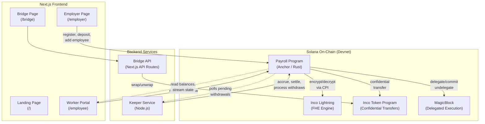
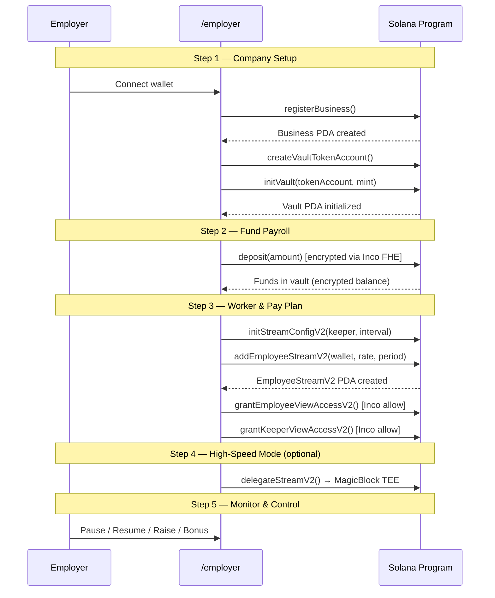
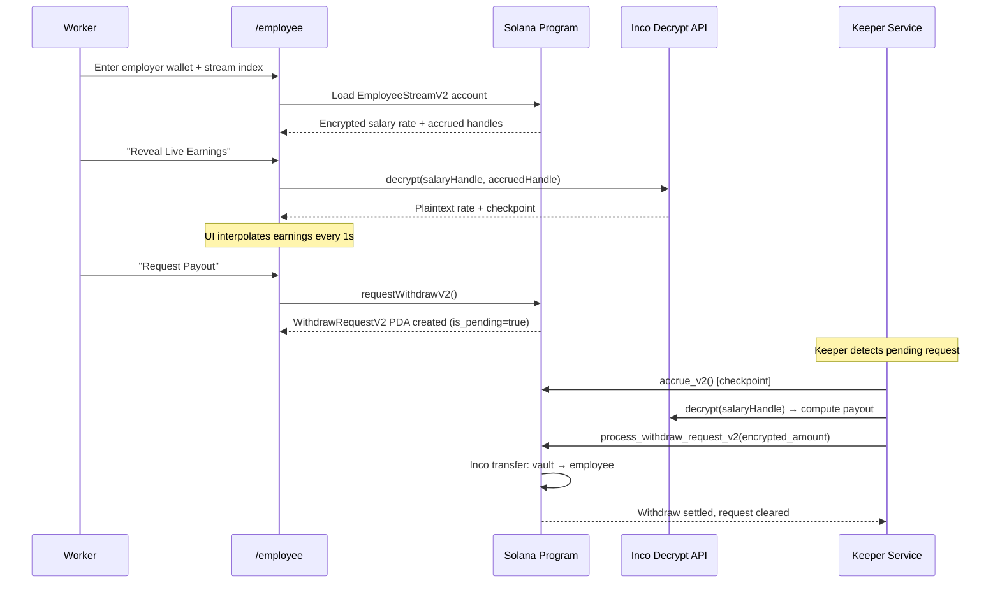
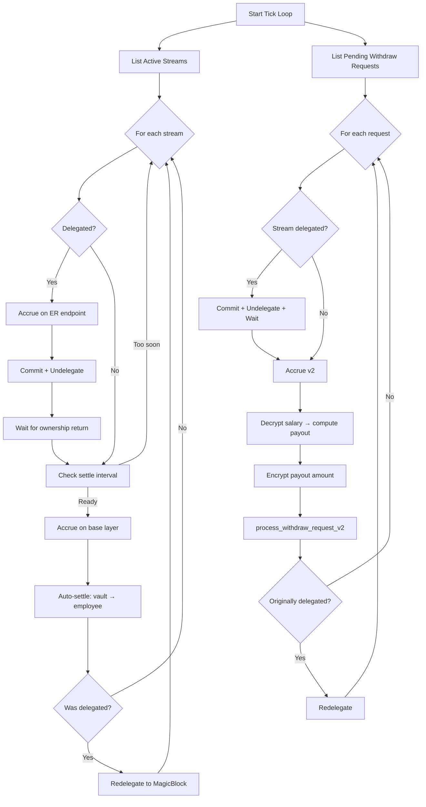
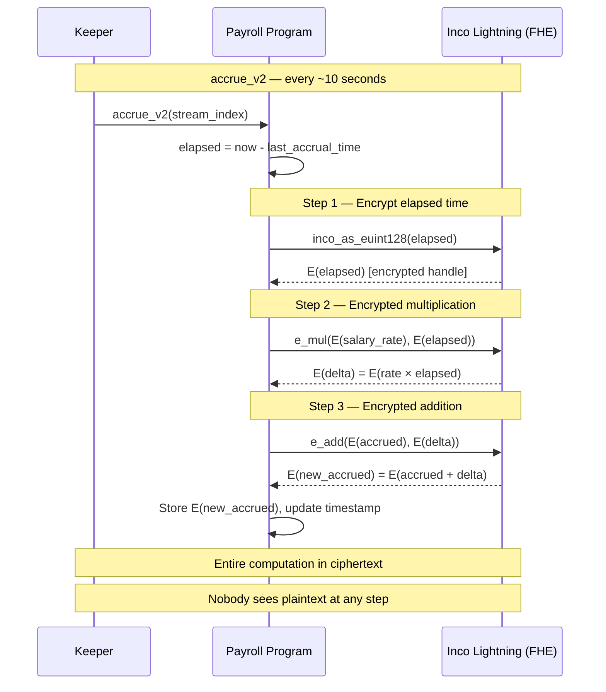
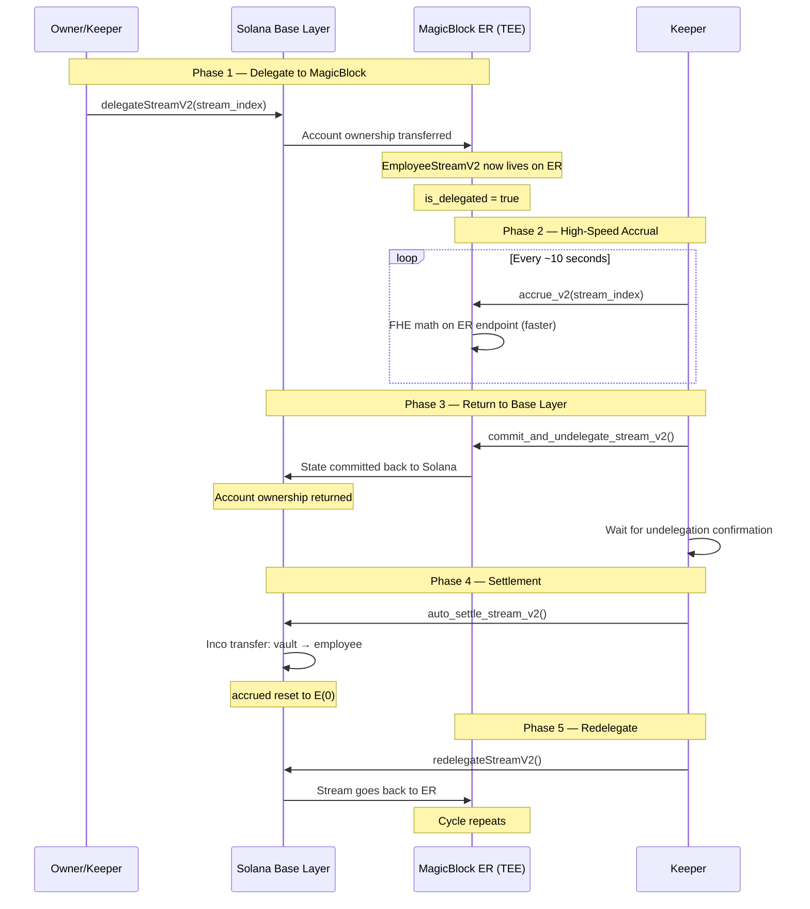
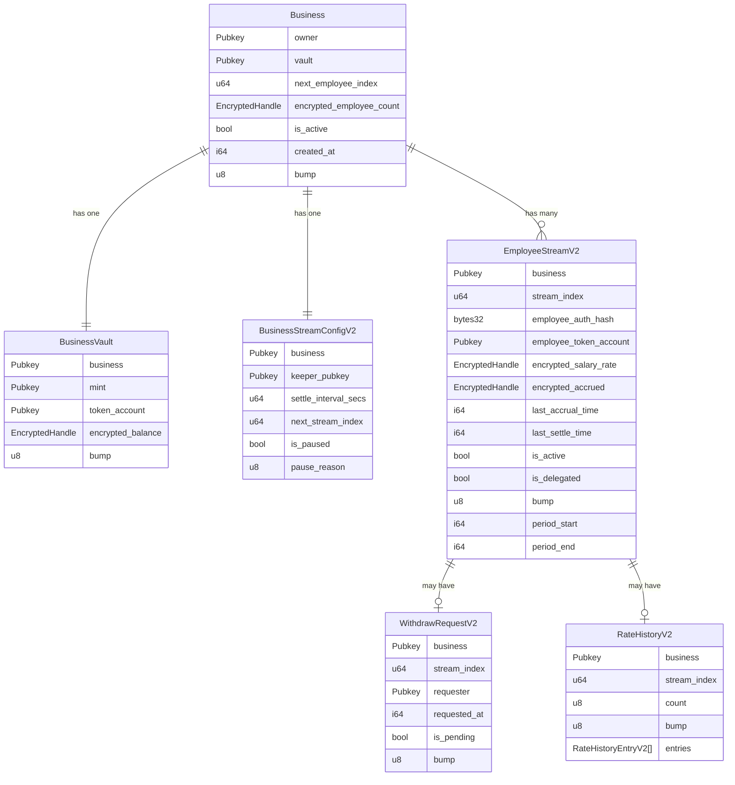
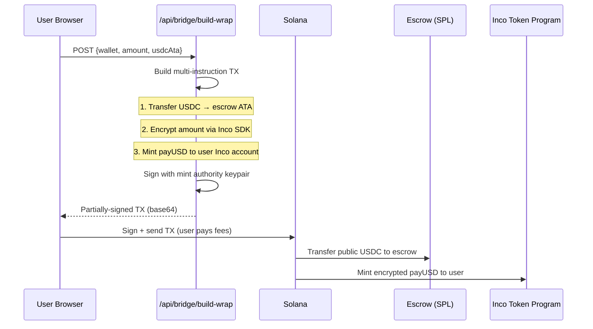
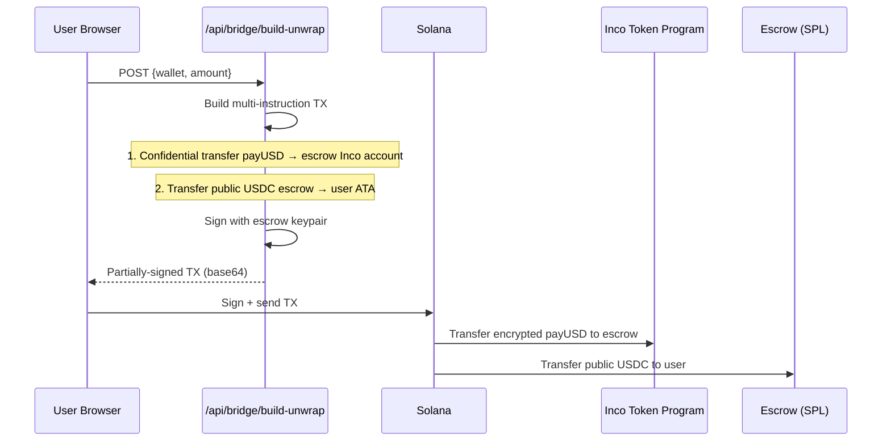

# Expensee — Confidential Streaming Payroll on Solana

> **Real-time salary streaming with full privacy.** Salaries accrue every second via **MagicBlock Ephemeral Rollups** for high-speed execution, encrypted end-to-end using **Inco Lightning's** Fully Homomorphic Encryption (FHE). Nobody — not coworkers, not competitors, not even on-chain observers — can see what anyone earns.
> 
> 🏆 **Expensee's Core Innovation:** Unlike other protocols that rely on unreliable devnet Zero-Knowledge (ZK) proofs for withdrawals, Expensee introduces a highly-optimized off-chain **Keeper Architecture**. This ensures 100% reliable Inco FHE decryption, payout calculation, and MagicBlock TEE delegation. Coupled with a **V2 Smart Contract Refactor** that stripped out V1 bloat, Expensee is faster, cheaper, and more dependable.

---

## Table of Contents

- [Problem Statement](#problem-statement)
- [Potential Impact](#potential-impact)
- [Business Case](#business-case)
- [How It Works — High-Level](#how-it-works--high-level)
- [Architecture Overview](#architecture-overview)
- [System Flow Diagrams](#system-flow-diagrams)
  - [Employer Flow](#employer-flow-5-step-wizard)
  - [Employee Flow](#employee-flow)
  - [Keeper Lifecycle](#keeper-lifecycle-loop)
  - [FHE Salary Accrual](#fhe-salary-accrual-pipeline)
  - [MagicBlock Delegation](#magicblock-delegation-lifecycle)
- [On-Chain Program Design](#on-chain-program-design)
- [Privacy Model](#privacy-model)
- [Tech Stack](#tech-stack)
- [Directory Structure](#directory-structure)
- [Deployed Addresses (Devnet)](#deployed-addresses-devnet)
- [Quick Start (Devnet)](#quick-start-devnet)
- [Bridge: Public USDC ↔ Confidential Token](#bridge-public-usdc--confidential-token)
- [Operational Model](#operational-model)
- [Compliance & Safety](#compliance--safety)

---

## Deployed Addresses (Devnet)

### Our Program

| Name | Address | Explorer |
|------|---------|----------|
| **Payroll Program** | `CgRkrU26uERpZEPXUQ2ANXgPMFHXPrX4bFaM5UHFdPEh` | [View](https://explorer.solana.com/address/CgRkrU26uERpZEPXUQ2ANXgPMFHXPrX4bFaM5UHFdPEh?cluster=devnet) |

### Token Mints

| Token | Address | Description |
|-------|---------|-------------|
| **payUSD (Confidential)** | `4FVrXQpUPFKMtR2bzfpu4idGJZSb9s7dqvfd2whZnRDJ` | FHE-encrypted payroll token (Inco) |
| **Public USDC (Demo)** | `FVoBx16c9JtsV94oS27yzJDr6q9DJNSWxjX3beN5PpnA` | SPL token for bridge demo |

### External Programs (Partners)

| Program | Address | Role |
|---------|---------|------|
| **Inco Lightning** | `5sjEbPiqgZrYwR31ahR6Uk9wf5awoX61YGg7jExQSwaj` | FHE engine — encrypt, decrypt, homomorphic ops |
| **Inco Token Program** | `4cyJHzecVWuU2xux6bCAPAhALKQT8woBh4Vx3AGEGe5N` | Confidential mint, transfer, balance |
| **MagicBlock Delegation** | `DELeGGvXpWV2fqJUhqcF5ZSYMS4JTLjteaAMARRSaeSh` | Ephemeral Rollup delegation |
| **MagicBlock Core** | `Magic11111111111111111111111111111111111111` | ER core program |
| **MagicBlock Validator** | `MEUGGrYPxKk17hCr7wpT6s8dtNokZj5U2L57vjYMS8e` | Devnet ER validator |

---


## Problem Statement

Crypto payroll is broken by a fundamental contradiction: **blockchains are transparent, but corporate payroll must be private and compliant.**

Today, if a company pays employees on a public ledger, competitors can reverse-engineer compensation strategies, poach top talent, and map out the corporate structure. To truly adopt blockchain technology for its speed and global reach, companies need an impenetrable privacy shield.

However, existing privacy protocols (like Bagel) over-correct by encrypting *everything* using heavy Zero-Knowledge Proofs or Fully Homomorphic Encryption (FHE), including the company's identity and headcount. This breaks the **Cost Basis audit trails** required for IRS Accountable Plans and Form 1099-DA.

**The core problem:** 2026 demands a perfect balance. Companies need absolute privacy for their employees' salaries, but verifiable openness for their corporate tax accounting. Expensee is the first protocol to strike this exact balance.

---

## The 2026 Privacy Stack (Expensee's Solution)

Expensee implements a pragmatic privacy architecture designed specifically for real-world FinTech adoption:

| Category | The "Private" Side (Hidden) | The "Open" Side (Verifiable) |
|---|---|---|
| **Identity** | **Employee Wallets:** Hidden via instant SHA-256 Auth Hashes. | **Employer Wallets:** Configured as public PDAs to verify corporate entity. |
| **Compensation**| **Salaries & Accruals:** 100% encrypted via Inco FHE. | **Total Headcount:** Left as public integers for instant UI loading. |
| **Taxes** | **Individual Payouts:** Encrypted confidential transfers. | **Audit Trails:** Public withdrawal TxHashes linkable to Web3 accounting software. |

By offloading the orchestration to a resilient **Node.js Keeper Backend**, Expensee provides the speed of Web2 with the cryptographic guarantees of Web3.

---

## Business Case

### Why a Company WANTS to use Expensee
- **Stop Competitor Poaching:** Because salaries are encrypted with Inco FHE, competitors cannot see how much your top engineers make.
- **Global Reach & Speed:** Sub-second salary streaming via MagicBlock TEE, with instant, zero-border stablecoin payouts.
- **Tax Compliance Ready:** Because the Corporate Treasury PDA is verifiable, CFOs can plug Expensee into Request Finance or QuickBooks to automate Form 1099-DA cost-basis tracking.
- **Zero-Knowledge UI:** Hashing employee identities (instead of FHE-encrypting them) means the dashboard loads instantly, without massive gas fees.

### For Workers (Employees)
| Today | With Expensee |
|-------|---------------|
| Wait until payday to access earned wages | **Request payout anytime** — your money, your schedule |
| Bank statements required for income proof | **Verifiable encrypted earnings** — cryptographically prove your income |
| Salary visible on public ledgers | **Only you can see your earnings** — decrypt with your wallet, nobody else can |
| Watch a number go up once a month | **Live earnings ticker** — watch your salary grow strictly off-chain via MagicBlock TEE |

---

## How It Works — High-Level

```
┌──────────────┐     encrypted      ┌──────────────────┐     encrypted     ┌──────────────┐
│   Employer    │ ───────────────►   │  Solana Program   │ ──────────────►  │   Employee    │
│   (Company)   │   deposit funds    │  (Confidential    │   stream salary  │   (Worker)    │
│               │                    │   Payroll Engine)  │                  │               │
│  • Set salary │                    │  • Accrue/sec     │                  │  • View live  │
│  • Fund vault │                    │  • Auto-settle    │                  │  • Request    │
│  • Add worker │                    │  • Withdraw flow  │                  │    payout     │
└──────────────┘                    └──────────────────┘                  └──────────────┘
       ▲                                     ▲                                    │
       │                              ┌──────┴──────┐                             │
       │                              │   Keeper    │                             │
       │                              │  (Automate) │◄────────────────────────────┘
       │                              └─────────────┘        withdrawal request
       │                                     │
       │                              ┌──────┴──────┐
       └──────────────────────────────│   Bridge    │
              optional wrap/unwrap    │ (USDC ↔ CT) │
                                      └─────────────┘
```

---

## Architecture Overview



---

## System Flow Diagrams

### Employer Flow (5-Step Wizard)



### Employee Flow



### Keeper Lifecycle Loop



---

### FHE Salary Accrual Pipeline

The core innovation: **salary accrual happens entirely in encrypted space**. Nobody — not the keeper, not validators, not MEV bots — ever sees plaintext amounts during computation.



**Key insight:** The elapsed time IS public (timestamps are on-chain), but it's encrypted before multiplication so the FHE engine never receives the private salary rate in plaintext. The result is a new encrypted handle that only authorized parties (employee, keeper) can decrypt.


### MagicBlock Delegation Lifecycle

For high-speed mode, employee streams are delegated to MagicBlock's **Ephemeral Rollup (ER)** for sub-second accrual, then returned to Solana base layer for settlement.



**Why this matters:** Accrual on the ER endpoint is faster and cheaper than base-layer transactions, but settlement (actual token transfer) must happen on Solana L1 for security. This hybrid approach gives you **speed of L2 with security of L1**.


---

## On-Chain Program Design

### Account Hierarchy



### PDA Seed Map

| Account | Seeds | Uniqueness |
|---------|-------|------------|
| Business | `["business", owner]` | One per wallet |
| BusinessVault | `["vault", business]` | One per business |
| BusinessStreamConfigV2 | `["stream_config_v2", business]` | One per business |
| EmployeeStreamV2 | `["employee_v2", business, stream_index]` | Index-based (no wallet) |
| WithdrawRequestV2 | `["withdraw_request_v2", business, stream_index]` | One per stream |
| RateHistoryV2 | `["rate_history_v2", business, stream_index]` | One per stream |

### Key Instructions

| Instruction | Caller | Description |
|-------------|--------|-------------|
| `register_business` | Owner | Creates Business PDA |
| `init_vault` | Owner | Creates vault + links Inco token account |
| `deposit` | Owner | Encrypts amount → Inco Token transfer to vault |
| `init_stream_config_v2` | Owner | Sets keeper wallet + settle interval |
| `add_employee_stream_v2` | Owner | Creates employee stream with encrypted rate |
| `grant_employee_view_access_v2` | Owner/Keeper | Inco `allow()` for employee to decrypt |
| `grant_keeper_view_access_v2` | Owner/Keeper | Inco `allow()` for keeper to decrypt |
| `delegate_stream_v2` | Owner/Keeper | Delegates stream to MagicBlock ER |
| `accrue_v2` | Keeper | `accrued += rate × elapsed` (encrypted FHE math) |
| `auto_settle_stream_v2` | Keeper | Transfer accrued → employee (via MagicBlock commit) |
| `request_withdraw_v2` | Employee | Creates pending WithdrawRequestV2 |
| `process_withdraw_request_v2` | Keeper | Settles withdraw: vault → employee (confidential) |
| `update_salary_rate_v2` | Owner/Keeper | Private raise (re-encrypts new rate) |
| `grant_bonus_v2` | Owner/Keeper | Adds encrypted bonus to accrued |
| `pause_stream_v2` / `resume_stream_v2` | Owner/Keeper | Emergency controls |

---

## Privacy Model

```
┌─────────────────────────────────────────────────────────────┐
│                    WHAT'S ENCRYPTED                         │
│                                                             │
│  • Salary rate (per second)      — EncryptedHandle (FHE)   │
│  • Accrued balance               — EncryptedHandle (FHE)   │
│  • Transfer amounts              — Inco ciphertext         │
│  • Vault balance                 — EncryptedHandle (FHE)   │
│  • Employee count                — EncryptedHandle (FHE)   │
│                                                             │
├─────────────────────────────────────────────────────────────┤
│                    WHAT'S ON-CHAIN (PUBLIC)                  │
│                                                             │
│  • Business exists (PDA)                                    │
│  • Stream index (NOT employee wallet)                       │
│  • Employee auth hash (SHA-256 of wallet — one-way)         │
│  • Fixed payout destination token account                   │
│  • Timestamps (last accrual, last settle)                   │
│  • Active/paused state                                      │
│  • Period bounds (start/end)                                │
│                                                             │
├─────────────────────────────────────────────────────────────┤
│                    WHO CAN DECRYPT                           │
│                                                             │
│  • Employee → their own salary rate + accrued (via Inco     │
│               allow() granted by employer)                  │
│  • Keeper   → salary rate for computing payouts             │
│  • Nobody else                                              │
└─────────────────────────────────────────────────────────────┘
```

**Index-based PDAs** prevent on-chain wallet correlation. The employee's wallet never appears in the PDA seeds — only a SHA-256 hash is stored for authentication.

---

## Tech Stack

| Layer | Technology |
|-------|-----------|
| Smart Contract | Rust + Anchor (Solana BPF) |
| Privacy Engine | [Inco Lightning](https://inco.org/) — Fully Homomorphic Encryption on Solana |
| Confidential Tokens | Inco Token Program — encrypted mint/transfer/balance |
| Delegated Execution | [MagicBlock](https://magicblock.gg/) — Ephemeral Rollups + TEE |
| Frontend | Next.js + TypeScript + Tailwind CSS |
| Wallet | Solana Wallet Adapter (Phantom, Solflare, etc.) |
| Keeper Service | Node.js (TypeScript) with exponential retry + RPC failover |
| Bridge | Next.js API Routes (custodial wrap/unwrap on devnet) |
| Compliance (optional) | Range Protocol — risk scoring + sanctions screening |

---

## Directory Structure

```
expensee/
├── programs/
│   └── payroll/
│       └── src/
│           ├── lib.rs              # Instruction handlers (~1,700 lines)
│           ├── constants.rs        # Program IDs, PDA seeds, config
│           ├── contexts.rs         # Account validation structs
│           ├── helpers.rs          # Inco CPI wrappers, transfer builders
│           ├── errors.rs           # PayrollError enum
│           ├── events.rs           # Event structs
│           └── state/              # Account data structs
│               ├── business.rs     # Business + BusinessVault
│               ├── employee.rs     # Employee, EmployeeStreamV2, RateHistoryV2
│               ├── stream_config.rs # BusinessStreamConfigV2
│               └── withdraw.rs     # WithdrawRequestV2
│
├── frontend/                             # Next.js frontend
│   ├── pages/
│   │   ├── index.tsx               # Landing page
│   │   ├── employer.tsx            # 5-step employer wizard (1,200+ lines)
│   │   ├── employee.tsx            # Worker portal with live ticker
│   │   ├── bridge.tsx              # Public USDC ↔ Confidential bridge
│   │   └── api/
│   │       ├── bridge/
│   │       │   ├── build-wrap.ts   # USDC → Confidential (mint)
│   │       │   └── build-unwrap.ts # Confidential → USDC (burn+transfer)
│   │       ├── inco/
│   │       │   └── reveal.ts       # Proxy for Inco attestation decrypt
│   │       └── magicblock/
│   │           ├── account-info.ts # MagicBlock router proxy
│   │           └── delegation-status.ts
│   ├── lib/
│   │   ├── payroll-client.ts       # TypeScript SDK (1,500+ lines)
│   │   │                            #   → PDA derivation, account parsing
│   │   │                            #   → Transaction builders
│   │   │                            #   → Inco encryption helpers
│   │   ├── copy.ts                 # UI copy strings
│   │   └── ui-state.ts             # Step state machine
│   ├── components/                  # Reusable UI components
│   │   ├── PageShell.tsx           # Layout wrapper
│   │   ├── StepCard.tsx            # Numbered step card
│   │   ├── StatusPill.tsx          # Status badge
│   │   ├── ActionResult.tsx        # Success/error/info banner
│   │   ├── AdvancedDetails.tsx     # Collapsible advanced section
│   │   ├── InlineHelp.tsx          # Help text
│   │   └── WalletButton.tsx        # Wallet connect button
│   ├── scripts/
│   │   ├── mint-payusd.cjs       # Mint confidential tokens (devnet)
│   │   ├── mint-public-usdc.cjs    # Mint public USDC (devnet)
│   │   └── register-token-metadata.cjs  # Register pUSDC in Phantom
│   └── styles/
│       └── globals.css             # Design system
│
├── services/
│   └── keeper/
│       └── src/
│           └── index.ts            # Keeper service (1,800+ lines)
│                                    #   → RPC failover + retry
│                                    #   → Accrue/settle loop
│                                    #   → Withdraw processing
│                                    #   → MagicBlock delegation lifecycle
│                                    #   → Inco decrypt + re-encrypt
│                                    #   → Compliance gating (Range)
│                                    #   → Dead letter + alerting
│
├── docs/
│   ├── HOW_IT_WORKS.md             # Detailed technical explanation
│   ├── runbook-v2.md               # Operational runbook
│   ├── demo-checklist-devnet.md    # Step-by-step demo guide
│   └── public-entry-exit-demo.md   # Bridge demo guide
│
├── keys/                            # Keypairs (gitignored)
├── Anchor.toml                      # Anchor config
├── Cargo.toml                       # Rust workspace
└── package.json                     # Root dependencies
```

---
## Quick Start (Devnet)

### 1. Deploy the Program

```bash
anchor build -p payroll
anchor deploy -p payroll --provider.cluster devnet
```

### 2. Configure Environment

```bash
cp frontend/.env.example frontend/.env.local
```

Key variables:
```env
NEXT_PUBLIC_PAYROLL_PROGRAM_ID=<your deployed program ID>
NEXT_PUBLIC_PAYUSD_MINT=<confidential mint address>
NEXT_PUBLIC_SOLANA_RPC_URL=https://devnet.helius-rpc.com/?api-key=<KEY>
NEXT_PUBLIC_PUBLIC_USDC_MINT=<public USDC mint for bridge>
```

### 3. Start the Frontend

```bash
npm install
npm run dev
```

Visit `http://localhost:3000`

### 4. Start the Keeper Service

```bash
cd backend/keeper
cp .env.example .env
# Set KEEPER_PAYER_KEYPAIR_PATH, KEEPER_PROGRAM_ID, etc.
npm install
npm start
```

### 5. Fund & Stream

1. **Create company** → `/employer` → Step 1
2. **Fund vault** → Mint devnet tokens, then deposit
3. **Add worker** → Configure pay plan, create stream
4. **Worker portal** → `/employee` → Load record → Reveal earnings → Request payout
5. **Bridge** (optional) → `/bridge` → Wrap/unwrap public USDC

#### Mint Helper (Devnet)
```bash
# Mint confidential tokens
node frontend/scripts/mint-payusd.cjs <TOKEN_ACCOUNT> <AMOUNT>

# Mint public USDC
node frontend/scripts/mint-public-usdc.cjs <WALLET> <AMOUNT>

# Register token metadata (so Phantom shows "pUSDC")
node frontend/scripts/register-token-metadata.cjs
```

---

## Bridge: Public USDC ↔ Confidential Token

The bridge demonstrates the real-world model: **public entry, private middle, public exit**.

### Wrap Flow (Public USDC → payUSD)



### Unwrap Flow (payUSD → Public USDC)



On devnet, this is a custodial bridge where the backend signs mint/escrow operations. In production, this would use a decentralized bridge with proper escrow contracts.

---

## Operational Model

### Request-Driven Withdrawal

1. **Accrual** — Salary accrues every ~10 seconds via encrypted FHE math (`rate × elapsed`)
2. **Request** — Employee submits `WithdrawRequestV2` on-chain
3. **Settlement** — Keeper detects request, decrypts salary, computes payout, encrypts amount, executes confidential transfer

### Keeper Resilience

- **RPC failover** — Multiple read RPCs with automatic fallback
- **Exponential retry** — Configurable max retries with backoff
- **Idempotency guards** — Prevents duplicate settlements per tick window
- **Dead letter logging** — Failed operations logged for manual review
- **Auto-allow decrypt** — Self-grants Inco decrypt permission when handles rotate

---

## Compliance & Safety

| Feature | Description |
|---------|-------------|
| **Emergency Pause** | Owner or keeper can instantly pause all streams |
| **Fixed Destinations** | Salary can only flow to pre-configured token accounts |
| **Auth Hash** | Employee identity verified via SHA-256 commitment (no wallet exposure) |
| **Accrual Freshness Guard** | Settlement requires accrual within 30 seconds (prevents stale payouts) |
| **Settle Cadence Guard** | Minimum interval between settlements prevents spam |
| **Range Compliance** (optional) | Risk scoring + sanctions screening before settlement |
| **Audit Events** | On-chain events log settlement handles for post-hoc verification |

---

*Built by the Expensee Team for the future of private payments on Solana.*
