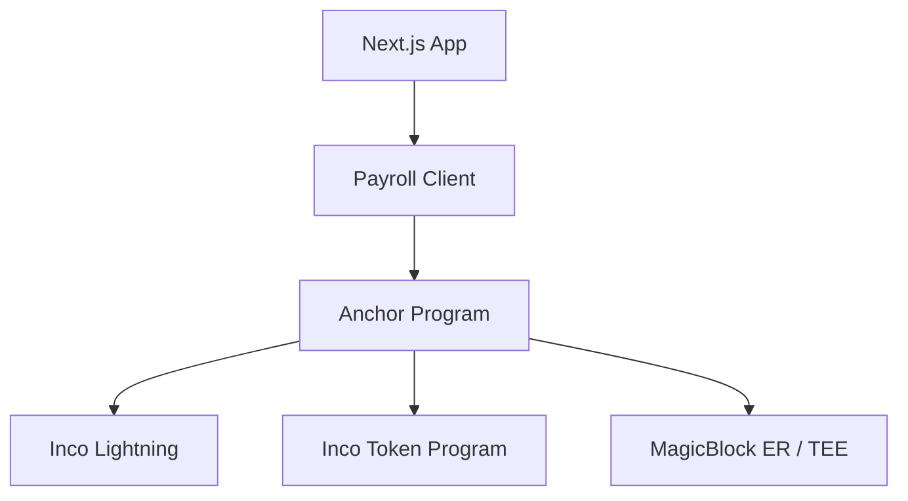
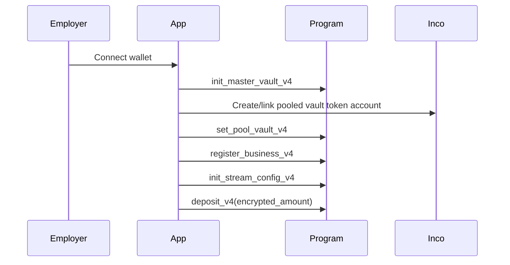
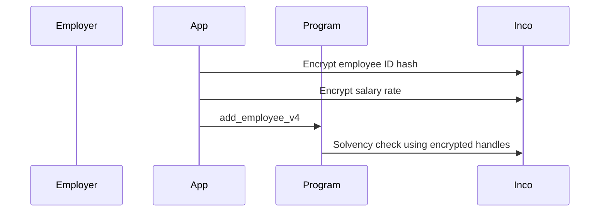
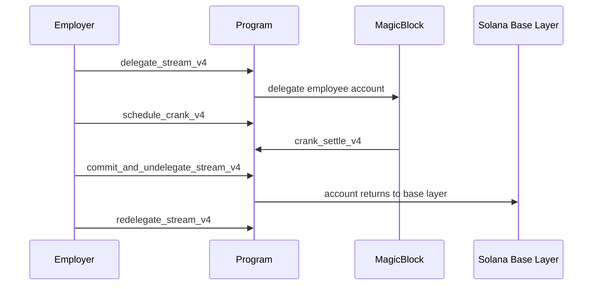
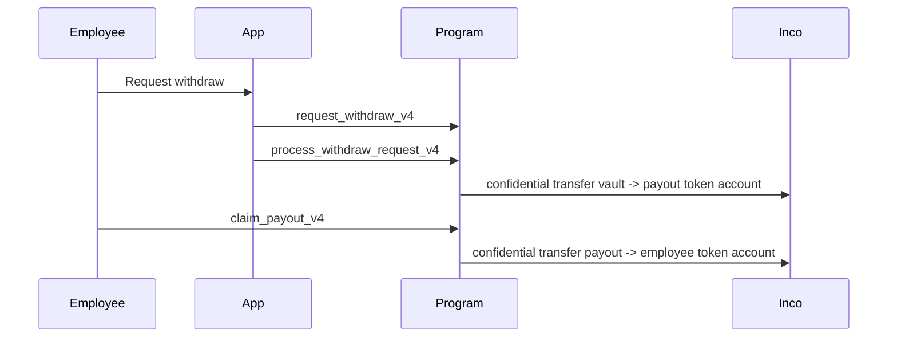

# How Expensee Works

Expensee is a devnet MVP for private payroll on Solana. The current codebase is v4-focused: a pooled confidential vault, encrypted employer/employee IDs, encrypted salary handles, MagicBlock-assisted stream execution, and shielded payout claims.

## Main Components



| Component | In This Repo | Purpose |
|---|---:|---|
| Anchor program | Yes | V4 payroll account model and instructions |
| Next.js app | Yes | Employer, employee, bridge, and API routes |
| Landing page | Yes | Public marketing site |
| Devnet scripts | Yes | Setup, withdraw, claim, delegation, verification helpers |

## V4 Account Model

| Account | Purpose |
|---|---|
| `MasterVaultV4` | Global pooled vault metadata and mint/vault token reference |
| `BusinessEntryV4` | One business under the master vault |
| `BusinessStreamConfigV4` | Settlement interval and pause state for a business |
| `EmployeeEntryV4` | Employee stream data, encrypted salary/accrued/budget handles |
| `UserTokenAccountV4` | Wallet-to-Inco-token-account registry |
| `WithdrawRequestV4` | Pending employee withdrawal request |
| `ShieldedPayoutV4` | Staged payout account claimed by employee |
| `RateHistoryV4` | Encrypted salary rate history |

## Setup Flow



After setup, the business has encrypted balance handles and can create employee streams.

## Employee Creation



Employee PDAs use:

```text
["employee_v4", business, employee_index]
```

The employee wallet is not part of the PDA seed. The app stores an encrypted identity handle derived from the wallet identity hash.

## Streaming

There are two accrual paths:

1. `accrue_v4` runs on the base layer and uses Inco operations for encrypted accounting.
2. `crank_settle_v4` runs in the MagicBlock ER/TEE path and updates delegated employee state before commit.

MagicBlock lifecycle:



## Withdrawal And Claim



The payout is staged in `ShieldedPayoutV4`, then claimed by the employee. Expired payouts can be cancelled and returned with `cancel_expired_payout_v4`.

## Where Code Lives

| Area | Path |
|---|---|
| Program entrypoint | `programs/payroll/src/lib.rs` |
| Account contexts | `programs/payroll/src/contexts.rs` |
| V4 account state | `programs/payroll/src/state/v4.rs` |
| Inco helpers | `programs/payroll/src/helpers.rs` |
| Main app client | `app/lib/payroll-client.ts` |
| MagicBlock helpers | `app/lib/magicblock/` |
| Employer UI | `app/pages/employer.tsx` |
| Employee UI | `app/pages/employee.tsx` |
| Bridge UI | `app/pages/bridge.tsx` |
| Devnet scripts | `scripts/` |

## Privacy Model

| Data | What Observers See |
|---|---|
| Salary rate | Encrypted Inco handle |
| Accrued balance | Encrypted Inco handle |
| Business/employee identity | Encrypted handle / index-based PDA |
| Payout amount | Confidential token transfer data |
| Timing and account existence | Public metadata |

Expensee hides payroll values, but it does not hide all metadata. Account creation, timing, and some relationships remain observable on-chain.

## Current Reality

This repo demonstrates a working devnet architecture. It is not yet production payroll infrastructure and should be audited, tested, and hardened before real funds are used.
