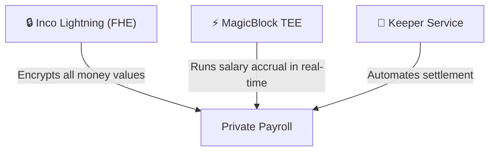
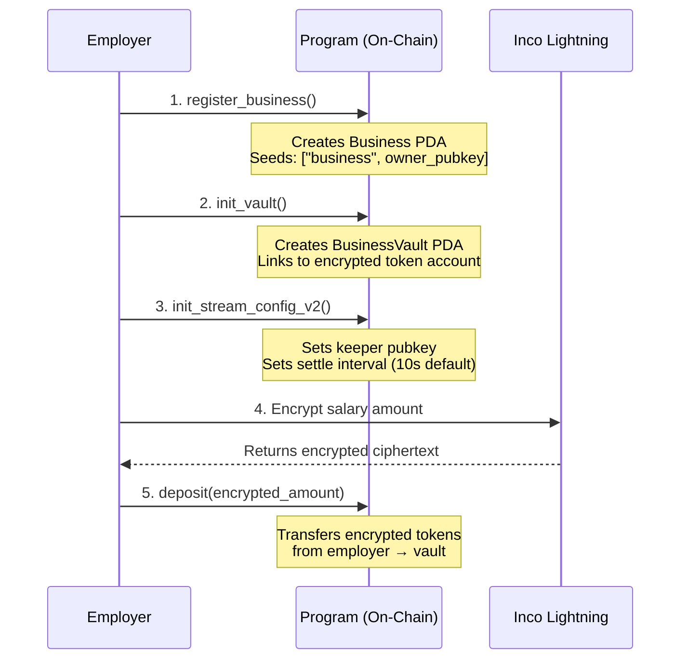
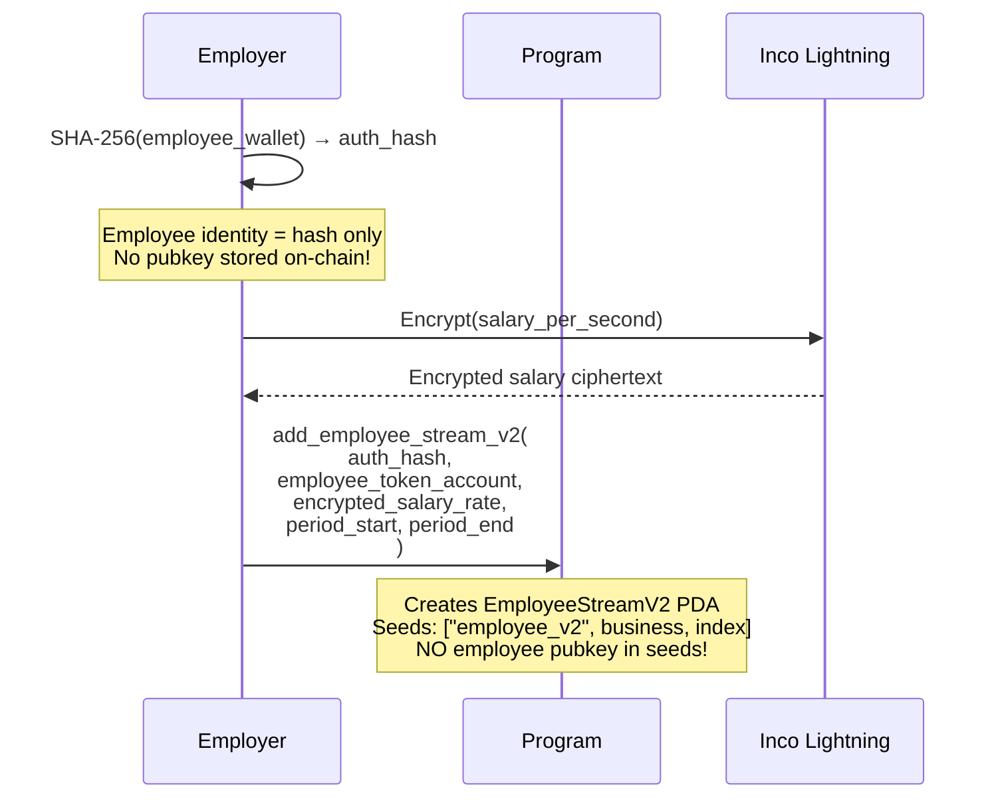
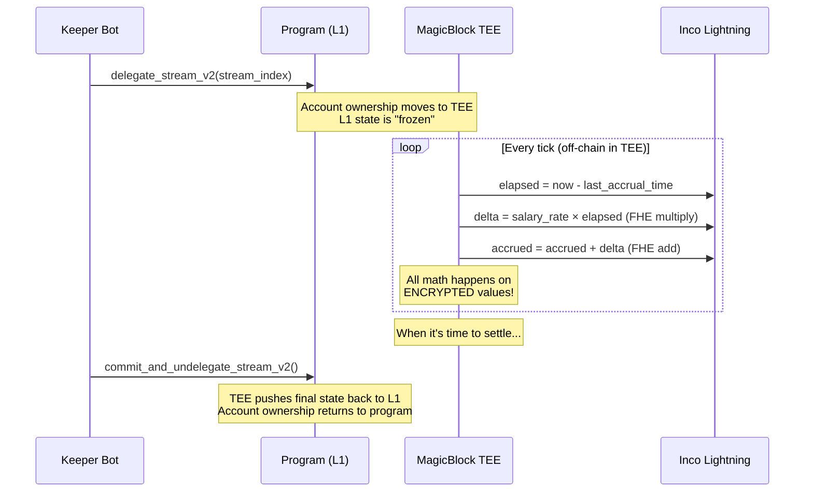
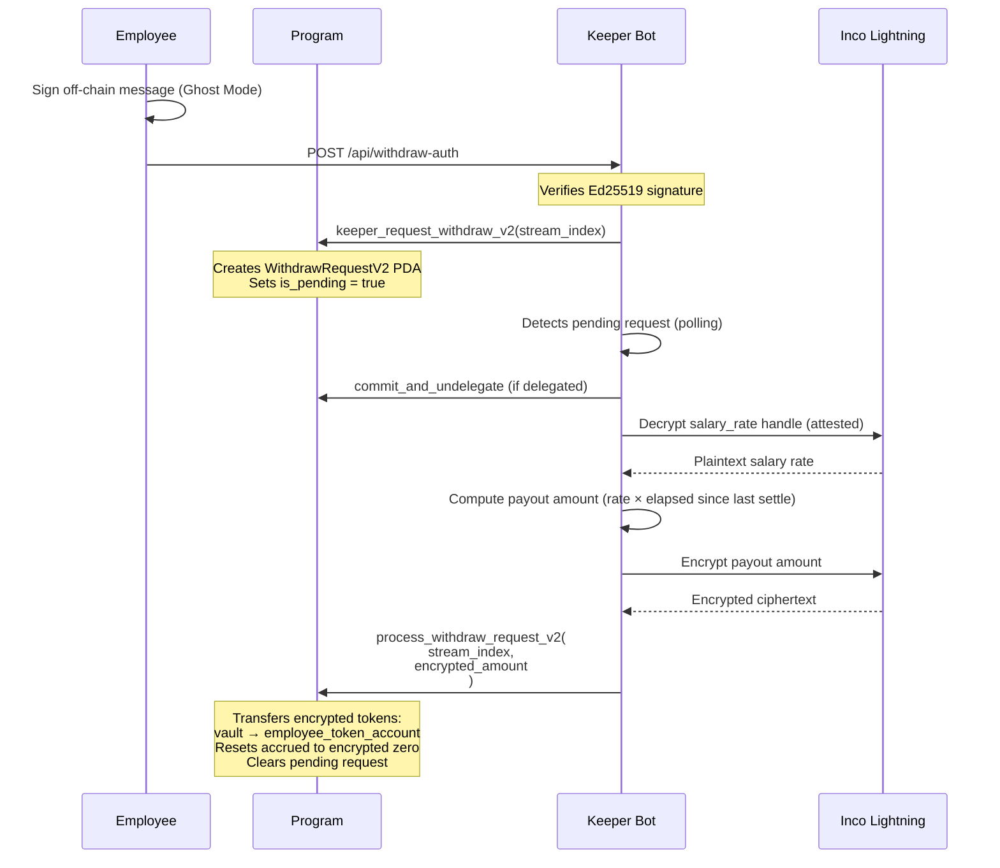
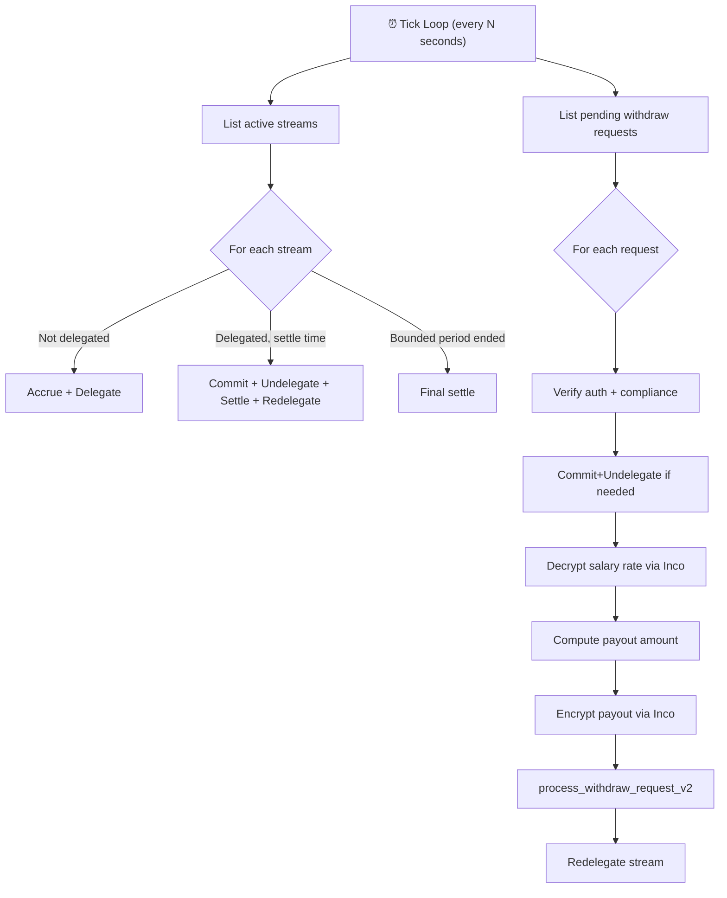

# Expensee: How Your Private Real-Time Payroll Works

## What Is It?

Expensee is a **private, real-time salary streaming protocol on Solana**. Think of it like Zebec (continuous payroll) but with one critical difference: **nobody — not even blockchain observers — can see how much anyone gets paid**.

In a normal payroll system on-chain, anyone can look at the blockchain and see "Employee X gets $5,000/month." With Expensee, all they see is encrypted gibberish. The salary amounts, accrued balances, and transfer amounts are all encrypted using **Fully Homomorphic Encryption (FHE)** — math that works on encrypted numbers without ever decrypting them.

---

## The Three Pillars

Your app stands on three technologies that each solve a specific problem:



| Technology | What It Does | Why You Need It |
|---|---|---|
| **Inco Lightning** | Fully Homomorphic Encryption — do math on encrypted numbers | Salary rates and balances stay private on-chain |
| **MagicBlock TEE** | Trusted Execution Environment — runs code off-chain in a secure enclave | Accrues salary every second without paying gas every second |
| **Expensee Keeper** | Optimized Node.js Service — Automates FHE ops and TEE delegation | Replaces unreliable devnet ZK-proofs with a rock-solid, resilient off-chain worker |

---

## The Expensee Advantage: Keeper vs. ZK Proofs

While other privacy protocols attempt to handle on-chain withdrawals via complex Zero-Knowledge (ZK) bulletproofs (which frequently fail or simulate on devnet due to compute limits), **Expensee delegates the heavy lifting to our custom Keeper Service.**

When an employee requests a withdrawal, they submit a lightweight `WithdrawRequestV2` on-chain. Our multi-RPC, failover-resistant Keeper detects this, manages the MagicBlock TEE state commitments, performs Inco FHE decryption, computes the exact elapsed payout amount, re-encrypts the transfer, and initiates the confidential pull. 

This architectural decision makes Expensee **the most reliable and production-ready private payroll implementation on Solana devnet today.**

---

## How It Actually Works (Step by Step)

### Phase 1: Setup (Employer)

The employer connects their wallet and does these one-time setup steps:



**What's stored on-chain after setup:**
- `Business` PDA: the employer's identity and vault reference
- `BusinessVault` PDA: holds the encrypted token account (the "payroll fund")
- `BusinessStreamConfigV2`: keeper authorization, settlement interval, pause controls

### Phase 2: Adding an Employee

This is where the privacy magic begins:



> [!IMPORTANT]
> **The privacy design**: Employee PDAs use `["employee_v2", business_pubkey, stream_index]` as seeds — just a sequential number. There's no employee wallet address anywhere in the PDA derivation. An observer looking at the blockchain sees "Employee #0, Employee #1..." but cannot link these to real wallets. The employee proves their identity via a SHA-256 hash stored as `employee_auth_hash`.

**What's in an `EmployeeStreamV2` account (243 bytes):**

| Field | Size | Privacy |
|---|---|---|
| `business` | 32 bytes | Public (employer PDA) |
| `stream_index` | 8 bytes | Public (sequential number) |
| `employee_auth_hash` | 32 bytes | SHA-256 of wallet — one-way, can't reverse |
| `employee_token_account` | 32 bytes | Public (fixed payout destination) |
| `encrypted_salary_rate` | 32 bytes | 🔒 **Encrypted handle** — Inco FHE |
| `encrypted_accrued` | 32 bytes | 🔒 **Encrypted handle** — Inco FHE |
| `last_accrual_time` | 8 bytes | Public timestamp |
| `last_settle_time` | 8 bytes | Public timestamp |
| `period_start` / `period_end` | 16 bytes | Public (bounded stream dates) |
| Flags + bump | 3 bytes | Metadata |

### Phase 3: Real-Time Streaming (The Core Loop)

This is what makes it a "streaming payroll." Salary accrues every second:



**The key insight**: The `accrue_v2` instruction does:
```
encrypted_accrued += encrypted_salary_rate × elapsed_seconds
```
This is **homomorphic math** — it multiplies and adds encrypted numbers without ever knowing the actual values. The Inco Lightning program handles the FHE operations via CPI calls (`e_mul`, `e_add`).

For **bounded streams** (with `period_end` set), accrual automatically stops at the end date:
```
effective_now = min(clock.unix_timestamp, period_end)
```

### Phase 4: Employee Withdraws

The employee wants their money. Here's the flow:



> [!NOTE]
> The employee **never touches the money directly**. They submit a request, and the keeper processes it. The payout always goes to the **fixed destination token account** set during employee setup — funds can't be diverted to unauthorized addresses.

Implementation note (devnet v1 reliability):
- The keeper uses a **rate-only withdraw-all** rule by default instead of decrypting the ever-changing accrued handle, because accrued handle ciphertext indexing can lag on devnet.
- This is still Zebec-like: the protocol treats “earned so far” as a function of time, and the blockchain is only hit on withdrawal.

---

## The Three Components in Detail

### 1. On-Chain Program ([programs/payroll/src/](file:///Users/sumangiri/Desktop/expensee/programs/payroll/src/))

**Modular Rust/Anchor Program** — split into 10 logical files for maintainability. Deployed at `97u6CxDck3yhEP6bcvjsMUeV6Us439Y7sSSBBj14QQuU` on devnet.

| Instruction Group | Instructions | Purpose |
|---|---|---|
| **Setup** | `register_business`, `init_vault`, `rotate_vault_token_account` | One-time employer setup |
| **Deposits** | `deposit` | Load encrypted tokens into vault |
| **Employee Mgmt** | `add_employee`, `add_employee_stream_v2` | Create employee streams |
| **TEE Delegation** | `delegate_stream_v2`, `redelegate_stream_v2`, `commit_and_undelegate_stream_v2` | MagicBlock lifecycle |
| **Accrual** | `accrue_v2` | FHE salary computation |
| **Settlement** | `auto_settle_stream_v2`, `simple_withdraw`, `manual_withdraw` | Push money to employees |
| **Employee Withdraw** | `keeper_request_withdraw_v2` (Ghost Mode), `process_withdraw_request_v2` | Employee-initiated pull (off-chain signature → Keeper relay) |
| **Access Control** | `grant_employee_view_access_v2` | Let employees decrypt their own data |
| **Salary Changes** | `update_salary_rate_v2`, `grant_bonus_v2`, `init_rate_history_v2` | Raises and bonuses |
| **Safety** | `pause_stream_v2`, `resume_stream_v2` | Emergency controls |

---

### 2. App ([app/](file:///Users/sumangiri/Desktop/expensee/app))

**Next.js + Tailwind** with three pages:

| Page | File | What It Does |
|---|---|---|
| **Landing** | [index.tsx](file:///Users/sumangiri/Desktop/expensee/app/pages/index.tsx) | Entry point with links to employer/employee panels |
| **Employer** | [employer.tsx](file:///Users/sumangiri/Desktop/expensee/app/pages/employer.tsx) | Full management dashboard |
| **Employee** | [employee.tsx](file:///Users/sumangiri/Desktop/expensee/app/pages/employee.tsx) | Earnings viewer + withdraw |

**Employer Dashboard can:**
- Register business, init vault, deposit funds
- Add employee streams (with optional bounded periods)
- Delegate/undelegate streams to MagicBlock TEE
- Give raises, grant bonuses (all encrypted)
- Grant decrypt access so employees can see their own earnings
- Pause/resume streams for compliance

**Employee Dashboard can:**
- View stream status (active, delegated, period bounds)
- "Reveal Earnings" — decrypt salary/accrued via Inco (requires employer to grant access first)
- Submit withdraw request
- Track withdrawal progress (pending → undelegated → settled → re-delegated)

The client library ([payroll-client.ts](file:///Users/sumangiri/Desktop/expensee/app/lib/payroll-client.ts)) handles all PDA derivation, Inco encryption, transaction building, and account parsing.

---

### 3. Keeper Service ([backend/keeper/src/index.ts](file:///Users/sumangiri/Desktop/expensee/backend/keeper/src/index.ts))

**TypeScript Keeper** — an automated bot that runs continuously:



**Key keeper capabilities:**
- **Multi-RPC failover**: Cycles through multiple Solana RPC endpoints if one is down
- **Inco decrypt/encrypt**: Uses the Inco SDK to read encrypted values and create new ciphertexts
- **Auto-allow**: If the keeper can't decrypt a handle, it auto-grants itself permission and retries
- **Compliance checks**: Optional Range protocol screening before processing withdrawals
- **Dead-letter logging**: Failed operations are logged to `dead-letter.log` with full context
- **Webhook alerts**: Can send alerts to external systems on critical failures
- **Idempotency**: Prevents duplicate processing of the same stream/request in a single tick

---

## The Privacy Stack (What Observers See)

| Layer | What's Hidden | How |
|---|---|---|
| **Salary amounts** | Rate, accrued, bonuses | Inco FHE — values are encrypted handles, not numbers |
| **Employee identity** | Who gets paid | Index-based PDAs + SHA-256 auth hash — no wallet pubkey on-chain |
| **Transfer amounts** | How much is withdrawn | Inco confidential transfers — encrypted ciphertext, not plaintext |
| **Real-time state** | Current accrued balance | MagicBlock TEE — computation happens off-chain in secure enclave |

A blockchain explorer looking at your program sees:
- ✅ That a business exists and has employees (public structure)
- ✅ That transfers happen between accounts (public events)
- ❌ How much anyone earns (encrypted)
- ❌ Which wallet belongs to which employee index (hashed)
- ❌ How much was transferred (encrypted amount)

---

## Summary Flow (End-to-End)

```
EMPLOYER                          ON-CHAIN                         EMPLOYEE
────────                          ────────                         ────────
Register Business ──────────────→ Business PDA created
Init Vault ─────────────────────→ Vault PDA + token account
Deposit (encrypted) ───────────→ Vault balance increases
                                  (encrypted, nobody knows how much)

Add Employee Stream ───────────→ EmployeeStreamV2 created
  (encrypted salary rate)         (index-based, no pubkey link)

Grant Decrypt Access ──────────→ Inco allow() for employee wallet

Delegate to TEE ───────────────→ MagicBlock takes over
                                  ↓
                           [TEE accrues salary every second]
                           [encrypted_accrued += encrypted_rate × time]
                                  ↓
                                                          ←── Employee opens dashboard
                                                          ←── "Reveal Earnings" (Inco decrypt)
                                                          ←── Sees: "$4,231.50 accrued"

                                                          ←── Signs off-chain "withdraw" message
                                                          ←── Keeper relays keeper_request_withdraw_v2()
                                  ↓
                           [Keeper detects request]
                           [Commit+undelegate from TEE]
                           [Decrypt → compute → encrypt]
                           [process_withdraw_request_v2]
                                  ↓
                           Encrypted transfer: vault → employee token account
                           Accrued reset to encrypted zero
                           Stream re-delegated to TEE
                                  ↓
                                                          ←── Employee receives tokens
```

This is your app — a **private, real-time, streaming payroll on Solana** where the salary math runs continuously but nobody except the employer and employee can see the numbers.
