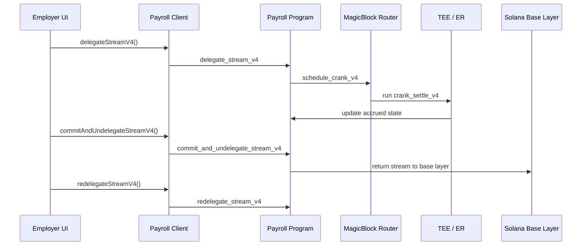

# MagicBlock Integration Map

This repository uses MagicBlock for one clear job: keep v4 payroll streaming real-time while preserving the ability to settle back to the Solana base layer when needed.

## What MagicBlock Does Here

MagicBlock is the execution layer for the v4 stream lifecycle:

1. Delegate a stream to a MagicBlock validator.
2. Schedule a crank on the MagicBlock router.
3. Run accrual inside the delegated TEE / ER environment.
4. Commit and undelegate back to base layer for settlement or mutation.
5. Redelegate so streaming continues.

This is a live product path, not a placeholder.

## Where It Lives

### On-chain program

- `programs/payroll/src/lib.rs`
- `programs/payroll/src/contexts.rs`
- `programs/payroll/src/constants.rs`

These files define the v4 MagicBlock instructions, account constraints, program IDs, and CPI wiring.

### Frontend client

- `app/lib/magicblock/index.ts`
- `app/lib/payroll-client.ts`

These files handle TEE auth, router connections, delegation helpers, crank scheduling, and commit / redelegate flows.

### UI entry points

- `app/pages/employer.tsx`
- `app/pages/employee.tsx`

These pages expose the real MagicBlock user journey:

- Employer delegation controls
- TEE auth status
- Crank scheduling
- Commit + undelegate
- Redelegate after settlement

### API probes

- `app/pages/api/magicblock/account-info.ts`
- `app/pages/api/magicblock/delegation-status.ts`

These routes query router / account state so the UI can show live delegation status.

### Supporting scripts

- `scripts/v4-delegate-cycle.cjs`
- `scripts/v4-withdraw-flow.cjs`
- `scripts/v4-keeper-free-withdraw.cjs`
- `scripts/v4-crank-e2e.cjs`
- `scripts/verify_er_cranks.cjs`

These scripts are useful for demos, verification, and keeper-style automation.

## Runtime Flow

## What Is Required

- v4 real-time stream delegation
- MagicBlock router for ER transactions
- TEE auth token for token-gated devnet endpoints
- commit + undelegate before base-layer mutation

## What Is Not MagicBlock-Specific

- Legacy or non-v4 flows
- Base-layer withdraw processing
- Inco FHE accounting itself
- General app navigation and read-only UI

## Demo Narrative

Use this wording when presenting the hackathon:

> Expensee delegates employee payroll streams into MagicBlock so salary accrues in real time inside the TEE. When a settlement or update is needed, the stream is committed back to Solana, then redelegated so streaming resumes.

## Quick Proof Points

- The employer page labels MagicBlock as required for high-speed mode.
- The employee page auto-enables TEE mode in v4 flows.
- The program contains explicit MagicBlock instructions for delegate, schedule, crank, commit, and redelegate.
- The API layer can query delegation status through the router.
